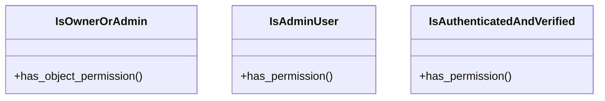

# core_modules.users.permissions

## Imports
- rest_framework

## Classes
- IsOwnerOrAdmin
  - method: `has_object_permission`
- IsAdminUser
  - method: `has_permission`
- IsAuthenticatedAndVerified
  - method: `has_permission`

## Functions
- has_object_permission
- has_permission
- has_permission

## Class Diagram

