# core_modules.users.serializers

## Imports
- django.contrib.auth
- django.utils.translation
- models
- rest_framework

## Classes
- UserProfileSerializer
- UserSettingsSerializer
- UserDeviceSerializer
- UserSessionSerializer
  - attr: `device`
- UserActivitySerializer
  - attr: `activity_type_display`
- UserNotificationPreferenceSerializer
- UserAPIKeySerializer
- UserSerializer
  - attr: `full_name`
  - attr: `profile`
  - attr: `settings`
- UserCreateSerializer
  - attr: `password`
  - attr: `password_confirm`
  - method: `validate`
  - method: `create`
- UserUpdateSerializer
  - method: `validate_email`
  - method: `validate_username`
- ChangePasswordSerializer
  - attr: `current_password`
  - attr: `new_password`
  - attr: `new_password_confirm`
  - method: `validate`
- ResetPasswordSerializer
  - attr: `email`
- SetNewPasswordSerializer
  - attr: `token`
  - attr: `uidb64`
  - attr: `password`
  - attr: `password_confirm`
  - method: `validate`
- LoginSerializer
  - attr: `email`
  - attr: `password`
  - attr: `remember_me`
- UserProfileUpdateSerializer
- UserSettingsUpdateSerializer
- UserNotificationPreferenceUpdateSerializer
- CreateAPIKeySerializer
  - attr: `name`
  - attr: `expires_in_days`
- RegisterDeviceSerializer
- Meta
  - attr: `model`
  - attr: `exclude`
  - attr: `read_only_fields`
- Meta
  - attr: `model`
  - attr: `exclude`
  - attr: `read_only_fields`
- Meta
  - attr: `model`
  - attr: `exclude`
  - attr: `read_only_fields`
- Meta
  - attr: `model`
  - attr: `exclude`
  - attr: `read_only_fields`
- Meta
  - attr: `model`
  - attr: `exclude`
  - attr: `read_only_fields`
- Meta
  - attr: `model`
  - attr: `exclude`
  - attr: `read_only_fields`
- Meta
  - attr: `model`
  - attr: `exclude`
  - attr: `read_only_fields`
- Meta
  - attr: `model`
  - attr: `fields`
  - attr: `read_only_fields`
- Meta
  - attr: `model`
  - attr: `fields`
- Meta
  - attr: `model`
  - attr: `fields`
- Meta
  - attr: `model`
  - attr: `exclude`
- Meta
  - attr: `model`
  - attr: `exclude`
- Meta
  - attr: `model`
  - attr: `exclude`
- Meta
  - attr: `model`
  - attr: `exclude`

## Functions
- validate
- create
- validate_email
- validate_username
- validate
- validate

## Module Variables
- `User`

## Class Diagram

```mermaid
classDiagram
    class UserProfileSerializer {
    }
    class UserSettingsSerializer {
    }
    class UserDeviceSerializer {
    }
    class UserSessionSerializer {
        +device
    }
    class UserActivitySerializer {
        +activity_type_display
    }
    class UserNotificationPreferenceSerializer {
    }
    class UserAPIKeySerializer {
    }
    class UserSerializer {
        +full_name
        +profile
        +settings
    }
    class UserCreateSerializer {
        +password
        +password_confirm
        +validate()
        +create()
    }
    class UserUpdateSerializer {
        +validate_email()
        +validate_username()
    }
    class ChangePasswordSerializer {
        +current_password
        +new_password
        +new_password_confirm
        +validate()
    }
    class ResetPasswordSerializer {
        +email
    }
    class SetNewPasswordSerializer {
        +token
        +uidb64
        +password
        +password_confirm
        +validate()
    }
    class LoginSerializer {
        +email
        +password
        +remember_me
    }
    class UserProfileUpdateSerializer {
    }
    class UserSettingsUpdateSerializer {
    }
    class UserNotificationPreferenceUpdateSerializer {
    }
    class CreateAPIKeySerializer {
        +name
        +expires_in_days
    }
    class RegisterDeviceSerializer {
    }
    class Meta {
        +model
        +exclude
        +read_only_fields
    }
    class Meta {
        +model
        +exclude
        +read_only_fields
    }
    class Meta {
        +model
        +exclude
        +read_only_fields
    }
    class Meta {
        +model
        +exclude
        +read_only_fields
    }
    class Meta {
        +model
        +exclude
        +read_only_fields
    }
    class Meta {
        +model
        +exclude
        +read_only_fields
    }
    class Meta {
        +model
        +exclude
        +read_only_fields
    }
    class Meta {
        +model
        +fields
        +read_only_fields
    }
    class Meta {
        +model
        +fields
    }
    class Meta {
        +model
        +fields
    }
    class Meta {
        +model
        +exclude
    }
    class Meta {
        +model
        +exclude
    }
    class Meta {
        +model
        +exclude
    }
    class Meta {
        +model
        +exclude
    }
    UserProfileSerializer --> Meta
    UserProfileSerializer --> Meta
    UserProfileSerializer --> Meta
    UserProfileSerializer --> Meta
    UserProfileSerializer --> Meta
    UserProfileSerializer --> Meta
    UserProfileSerializer --> Meta
    UserProfileSerializer --> Meta
    UserProfileSerializer --> Meta
    UserProfileSerializer --> Meta
    UserProfileSerializer --> Meta
    UserProfileSerializer --> Meta
    UserProfileSerializer --> Meta
    UserProfileSerializer --> Meta
    UserSettingsSerializer --> Meta
    UserSettingsSerializer --> Meta
    UserSettingsSerializer --> Meta
    UserSettingsSerializer --> Meta
    UserSettingsSerializer --> Meta
    UserSettingsSerializer --> Meta
    UserSettingsSerializer --> Meta
    UserSettingsSerializer --> Meta
    UserSettingsSerializer --> Meta
    UserSettingsSerializer --> Meta
    UserSettingsSerializer --> Meta
    UserSettingsSerializer --> Meta
    UserSettingsSerializer --> Meta
    UserSettingsSerializer --> Meta
    UserDeviceSerializer --> Meta
    UserDeviceSerializer --> Meta
    UserDeviceSerializer --> Meta
    UserDeviceSerializer --> Meta
    UserDeviceSerializer --> Meta
    UserDeviceSerializer --> Meta
    UserDeviceSerializer --> Meta
    UserDeviceSerializer --> Meta
    UserDeviceSerializer --> Meta
    UserDeviceSerializer --> Meta
    UserDeviceSerializer --> Meta
    UserDeviceSerializer --> Meta
    UserDeviceSerializer --> Meta
    UserDeviceSerializer --> Meta
    UserSessionSerializer --> Meta
    UserSessionSerializer --> Meta
    UserSessionSerializer --> Meta
    UserSessionSerializer --> Meta
    UserSessionSerializer --> Meta
    UserSessionSerializer --> Meta
    UserSessionSerializer --> Meta
    UserSessionSerializer --> Meta
    UserSessionSerializer --> Meta
    UserSessionSerializer --> Meta
    UserSessionSerializer --> Meta
    UserSessionSerializer --> Meta
    UserSessionSerializer --> Meta
    UserSessionSerializer --> Meta
    UserActivitySerializer --> Meta
    UserActivitySerializer --> Meta
    UserActivitySerializer --> Meta
    UserActivitySerializer --> Meta
    UserActivitySerializer --> Meta
    UserActivitySerializer --> Meta
    UserActivitySerializer --> Meta
    UserActivitySerializer --> Meta
    UserActivitySerializer --> Meta
    UserActivitySerializer --> Meta
    UserActivitySerializer --> Meta
    UserActivitySerializer --> Meta
    UserActivitySerializer --> Meta
    UserActivitySerializer --> Meta
    UserNotificationPreferenceSerializer --> Meta
    UserNotificationPreferenceSerializer --> Meta
    UserNotificationPreferenceSerializer --> Meta
    UserNotificationPreferenceSerializer --> Meta
    UserNotificationPreferenceSerializer --> Meta
    UserNotificationPreferenceSerializer --> Meta
    UserNotificationPreferenceSerializer --> Meta
    UserNotificationPreferenceSerializer --> Meta
    UserNotificationPreferenceSerializer --> Meta
    UserNotificationPreferenceSerializer --> Meta
    UserNotificationPreferenceSerializer --> Meta
    UserNotificationPreferenceSerializer --> Meta
    UserNotificationPreferenceSerializer --> Meta
    UserNotificationPreferenceSerializer --> Meta
    UserAPIKeySerializer --> Meta
    UserAPIKeySerializer --> Meta
    UserAPIKeySerializer --> Meta
    UserAPIKeySerializer --> Meta
    UserAPIKeySerializer --> Meta
    UserAPIKeySerializer --> Meta
    UserAPIKeySerializer --> Meta
    UserAPIKeySerializer --> Meta
    UserAPIKeySerializer --> Meta
    UserAPIKeySerializer --> Meta
    UserAPIKeySerializer --> Meta
    UserAPIKeySerializer --> Meta
    UserAPIKeySerializer --> Meta
    UserAPIKeySerializer --> Meta
    UserSerializer --> Meta
    UserSerializer --> Meta
    UserSerializer --> Meta
    UserSerializer --> Meta
    UserSerializer --> Meta
    UserSerializer --> Meta
    UserSerializer --> Meta
    UserSerializer --> Meta
    UserSerializer --> Meta
    UserSerializer --> Meta
    UserSerializer --> Meta
    UserSerializer --> Meta
    UserSerializer --> Meta
    UserSerializer --> Meta
    UserCreateSerializer --> Meta
    UserCreateSerializer --> Meta
    UserCreateSerializer --> Meta
    UserCreateSerializer --> Meta
    UserCreateSerializer --> Meta
    UserCreateSerializer --> Meta
    UserCreateSerializer --> Meta
    UserCreateSerializer --> Meta
    UserCreateSerializer --> Meta
    UserCreateSerializer --> Meta
    UserCreateSerializer --> Meta
    UserCreateSerializer --> Meta
    UserCreateSerializer --> Meta
    UserCreateSerializer --> Meta
    UserUpdateSerializer --> Meta
    UserUpdateSerializer --> Meta
    UserUpdateSerializer --> Meta
    UserUpdateSerializer --> Meta
    UserUpdateSerializer --> Meta
    UserUpdateSerializer --> Meta
    UserUpdateSerializer --> Meta
    UserUpdateSerializer --> Meta
    UserUpdateSerializer --> Meta
    UserUpdateSerializer --> Meta
    UserUpdateSerializer --> Meta
    UserUpdateSerializer --> Meta
    UserUpdateSerializer --> Meta
    UserUpdateSerializer --> Meta
    ChangePasswordSerializer --> Meta
    ChangePasswordSerializer --> Meta
    ChangePasswordSerializer --> Meta
    ChangePasswordSerializer --> Meta
    ChangePasswordSerializer --> Meta
    ChangePasswordSerializer --> Meta
    ChangePasswordSerializer --> Meta
    ChangePasswordSerializer --> Meta
    ChangePasswordSerializer --> Meta
    ChangePasswordSerializer --> Meta
    ChangePasswordSerializer --> Meta
    ChangePasswordSerializer --> Meta
    ChangePasswordSerializer --> Meta
    ChangePasswordSerializer --> Meta
    ResetPasswordSerializer --> Meta
    ResetPasswordSerializer --> Meta
    ResetPasswordSerializer --> Meta
    ResetPasswordSerializer --> Meta
    ResetPasswordSerializer --> Meta
    ResetPasswordSerializer --> Meta
    ResetPasswordSerializer --> Meta
    ResetPasswordSerializer --> Meta
    ResetPasswordSerializer --> Meta
    ResetPasswordSerializer --> Meta
    ResetPasswordSerializer --> Meta
    ResetPasswordSerializer --> Meta
    ResetPasswordSerializer --> Meta
    ResetPasswordSerializer --> Meta
    SetNewPasswordSerializer --> Meta
    SetNewPasswordSerializer --> Meta
    SetNewPasswordSerializer --> Meta
    SetNewPasswordSerializer --> Meta
    SetNewPasswordSerializer --> Meta
    SetNewPasswordSerializer --> Meta
    SetNewPasswordSerializer --> Meta
    SetNewPasswordSerializer --> Meta
    SetNewPasswordSerializer --> Meta
    SetNewPasswordSerializer --> Meta
    SetNewPasswordSerializer --> Meta
    SetNewPasswordSerializer --> Meta
    SetNewPasswordSerializer --> Meta
    SetNewPasswordSerializer --> Meta
    LoginSerializer --> Meta
    LoginSerializer --> Meta
    LoginSerializer --> Meta
    LoginSerializer --> Meta
    LoginSerializer --> Meta
    LoginSerializer --> Meta
    LoginSerializer --> Meta
    LoginSerializer --> Meta
    LoginSerializer --> Meta
    LoginSerializer --> Meta
    LoginSerializer --> Meta
    LoginSerializer --> Meta
    LoginSerializer --> Meta
    LoginSerializer --> Meta
    UserProfileUpdateSerializer --> Meta
    UserProfileUpdateSerializer --> Meta
    UserProfileUpdateSerializer --> Meta
    UserProfileUpdateSerializer --> Meta
    UserProfileUpdateSerializer --> Meta
    UserProfileUpdateSerializer --> Meta
    UserProfileUpdateSerializer --> Meta
    UserProfileUpdateSerializer --> Meta
    UserProfileUpdateSerializer --> Meta
    UserProfileUpdateSerializer --> Meta
    UserProfileUpdateSerializer --> Meta
    UserProfileUpdateSerializer --> Meta
    UserProfileUpdateSerializer --> Meta
    UserProfileUpdateSerializer --> Meta
    UserSettingsUpdateSerializer --> Meta
    UserSettingsUpdateSerializer --> Meta
    UserSettingsUpdateSerializer --> Meta
    UserSettingsUpdateSerializer --> Meta
    UserSettingsUpdateSerializer --> Meta
    UserSettingsUpdateSerializer --> Meta
    UserSettingsUpdateSerializer --> Meta
    UserSettingsUpdateSerializer --> Meta
    UserSettingsUpdateSerializer --> Meta
    UserSettingsUpdateSerializer --> Meta
    UserSettingsUpdateSerializer --> Meta
    UserSettingsUpdateSerializer --> Meta
    UserSettingsUpdateSerializer --> Meta
    UserSettingsUpdateSerializer --> Meta
    UserNotificationPreferenceUpdateSerializer --> Meta
    UserNotificationPreferenceUpdateSerializer --> Meta
    UserNotificationPreferenceUpdateSerializer --> Meta
    UserNotificationPreferenceUpdateSerializer --> Meta
    UserNotificationPreferenceUpdateSerializer --> Meta
    UserNotificationPreferenceUpdateSerializer --> Meta
    UserNotificationPreferenceUpdateSerializer --> Meta
    UserNotificationPreferenceUpdateSerializer --> Meta
    UserNotificationPreferenceUpdateSerializer --> Meta
    UserNotificationPreferenceUpdateSerializer --> Meta
    UserNotificationPreferenceUpdateSerializer --> Meta
    UserNotificationPreferenceUpdateSerializer --> Meta
    UserNotificationPreferenceUpdateSerializer --> Meta
    UserNotificationPreferenceUpdateSerializer --> Meta
    CreateAPIKeySerializer --> Meta
    CreateAPIKeySerializer --> Meta
    CreateAPIKeySerializer --> Meta
    CreateAPIKeySerializer --> Meta
    CreateAPIKeySerializer --> Meta
    CreateAPIKeySerializer --> Meta
    CreateAPIKeySerializer --> Meta
    CreateAPIKeySerializer --> Meta
    CreateAPIKeySerializer --> Meta
    CreateAPIKeySerializer --> Meta
    CreateAPIKeySerializer --> Meta
    CreateAPIKeySerializer --> Meta
    CreateAPIKeySerializer --> Meta
    CreateAPIKeySerializer --> Meta
    RegisterDeviceSerializer --> Meta
    RegisterDeviceSerializer --> Meta
    RegisterDeviceSerializer --> Meta
    RegisterDeviceSerializer --> Meta
    RegisterDeviceSerializer --> Meta
    RegisterDeviceSerializer --> Meta
    RegisterDeviceSerializer --> Meta
    RegisterDeviceSerializer --> Meta
    RegisterDeviceSerializer --> Meta
    RegisterDeviceSerializer --> Meta
    RegisterDeviceSerializer --> Meta
    RegisterDeviceSerializer --> Meta
    RegisterDeviceSerializer --> Meta
    RegisterDeviceSerializer --> Meta
```

