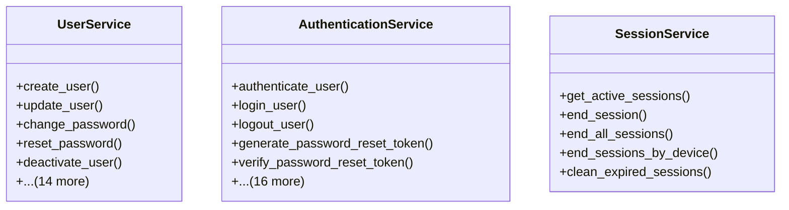

# core_modules.users.services

## Imports
- datetime
- django.conf
- django.contrib.auth
- django.contrib.auth.tokens
- django.core.mail
- django.template.loader
- django.utils
- django.utils.encoding
- django.utils.http
- django.utils.translation
- hashlib
- logging
- models
- re
- secrets

## Classes
- UserService
  - method: `create_user`
  - method: `update_user`
  - method: `change_password`
  - method: `reset_password`
  - method: `deactivate_user`
  - method: `activate_user`
  - method: `delete_user`
  - method: `update_profile`
  - method: `update_settings`
  - method: `update_notification_preferences`
  - method: `create_api_key`
  - method: `revoke_api_key`
  - method: `verify_api_key`
  - method: `register_device`
  - method: `update_device`
  - method: `deactivate_device`
  - method: `get_user_activities`
  - method: `get_user_login_attempts`
  - method: `_create_default_notification_preferences`
- AuthenticationService
  - method: `authenticate_user`
  - method: `login_user`
  - method: `logout_user`
  - method: `generate_password_reset_token`
  - method: `verify_password_reset_token`
  - method: `send_password_reset_email`
  - method: `send_verification_email`
  - method: `verify_email`
  - method: `_get_client_ip`
  - method: `_get_device_info`
  - method: `_extract_windows_version`
  - method: `_extract_macos_version`
  - method: `_extract_linux_version`
  - method: `_extract_android_version`
  - method: `_extract_ios_version`
  - method: `_extract_chrome_version`
  - method: `_extract_firefox_version`
  - method: `_extract_safari_version`
  - method: `_extract_edge_version`
  - method: `_extract_ie_version`
  - method: `_extract_opera_version`
- SessionService
  - method: `get_active_sessions`
  - method: `end_session`
  - method: `end_all_sessions`
  - method: `end_sessions_by_device`
  - method: `clean_expired_sessions`

## Functions
- create_user
- update_user
- change_password
- reset_password
- deactivate_user
- activate_user
- delete_user
- update_profile
- update_settings
- update_notification_preferences
- create_api_key
- revoke_api_key
- verify_api_key
- register_device
- update_device
- deactivate_device
- get_user_activities
- get_user_login_attempts
- _create_default_notification_preferences
- authenticate_user
- login_user
- logout_user
- generate_password_reset_token
- verify_password_reset_token
- send_password_reset_email
- send_verification_email
- verify_email
- _get_client_ip
- _get_device_info
- _extract_windows_version
- _extract_macos_version
- _extract_linux_version
- _extract_android_version
- _extract_ios_version
- _extract_chrome_version
- _extract_firefox_version
- _extract_safari_version
- _extract_edge_version
- _extract_ie_version
- _extract_opera_version
- get_active_sessions
- end_session
- end_all_sessions
- end_sessions_by_device
- clean_expired_sessions

## Module Variables
- `logger`

## Class Diagram

