# core_modules.users.tests

## Imports
- datetime
- django.contrib.auth
- django.contrib.contenttypes.models
- django.test
- django.utils
- models

## Classes
- UserModelTests
  - method: `setUp`
  - method: `test_create_user`
  - method: `test_create_superuser`
  - method: `test_get_full_name`
  - method: `test_get_short_name`
  - method: `test_lock_account`
  - method: `test_unlock_account`
  - method: `test_increment_failed_login`
  - method: `test_reset_failed_login`
  - method: `test_account_lock_after_five_failed_attempts`
- UserProfileTests
  - method: `setUp`
  - method: `test_create_profile`
  - method: `test_profile_str_representation`
- UserSettingsTests
  - method: `setUp`
  - method: `test_create_settings`
  - method: `test_settings_str_representation`
- UserDeviceTests
  - method: `setUp`
  - method: `test_create_device`
  - method: `test_device_str_representation`
- UserSessionTests
  - method: `setUp`
  - method: `test_create_session`
  - method: `test_end_session`
  - method: `test_session_str_representation`
- UserActivityTests
  - method: `setUp`
  - method: `test_create_activity`
  - method: `test_activity_str_representation`
- UserNotificationPreferenceTests
  - method: `setUp`
  - method: `test_create_notification_preference`
  - method: `test_notification_preference_str_representation`
- UserAPIKeyTests
  - method: `setUp`
  - method: `test_create_api_key`
  - method: `test_generate_key`
  - method: `test_verify_key`
  - method: `test_is_expired`
  - method: `test_has_permission`
  - method: `test_api_key_str_representation`

## Functions
- setUp
- test_create_user
- test_create_superuser
- test_get_full_name
- test_get_short_name
- test_lock_account
- test_unlock_account
- test_increment_failed_login
- test_reset_failed_login
- test_account_lock_after_five_failed_attempts
- setUp
- test_create_profile
- test_profile_str_representation
- setUp
- test_create_settings
- test_settings_str_representation
- setUp
- test_create_device
- test_device_str_representation
- setUp
- test_create_session
- test_end_session
- test_session_str_representation
- setUp
- test_create_activity
- test_activity_str_representation
- setUp
- test_create_notification_preference
- test_notification_preference_str_representation
- setUp
- test_create_api_key
- test_generate_key
- test_verify_key
- test_is_expired
- test_has_permission
- test_api_key_str_representation

## Module Variables
- `User`

## Class Diagram

```mermaid
classDiagram
    class UserModelTests {
        +setUp()
        +test_create_user()
        +test_create_superuser()
        +test_get_full_name()
        +test_get_short_name()
        +... (5 more)
    }
    class UserProfileTests {
        +setUp()
        +test_create_profile()
        +test_profile_str_representation()
    }
    class UserSettingsTests {
        +setUp()
        +test_create_settings()
        +test_settings_str_representation()
    }
    class UserDeviceTests {
        +setUp()
        +test_create_device()
        +test_device_str_representation()
    }
    class UserSessionTests {
        +setUp()
        +test_create_session()
        +test_end_session()
        +test_session_str_representation()
    }
    class UserActivityTests {
        +setUp()
        +test_create_activity()
        +test_activity_str_representation()
    }
    class UserNotificationPreferenceTests {
        +setUp()
        +test_create_notification_preference()
        +test_notification_preference_str_representation()
    }
    class UserAPIKeyTests {
        +setUp()
        +test_create_api_key()
        +test_generate_key()
        +test_verify_key()
        +test_is_expired()
        +... (2 more)
    }
```

