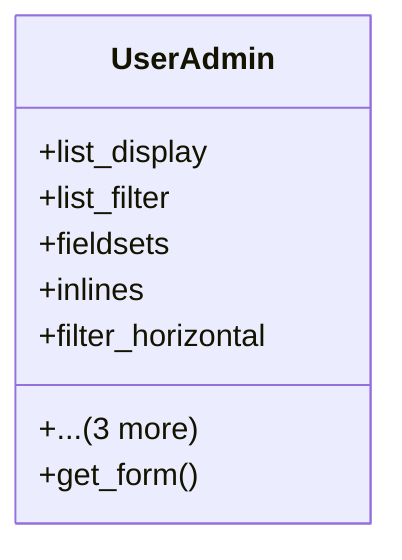

# core_modules.users_accounts.admin

## Imports
- admin_modules.permissions_manager.admin
- django.contrib
- django.contrib.auth.admin
- django.contrib.auth.models
- django.utils.translation
- models

## Classes
- UserAdmin
  - attr: `list_display`
  - attr: `list_filter`
  - attr: `fieldsets`
  - attr: `inlines`
  - attr: `filter_horizontal`
  - attr: `search_fields`
  - attr: `ordering`
  - attr: `readonly_fields`
  - method: `get_form`

## Functions
- get_form

## Class Diagram

