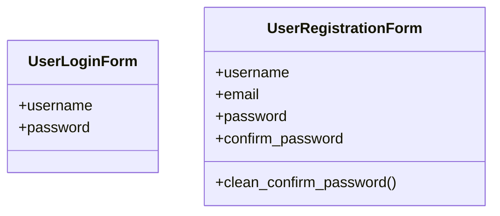

# core_modules.users_accounts.forms

## Imports
- django

## Classes
- UserLoginForm
  - attr: `username`
  - attr: `password`
- UserRegistrationForm
  - attr: `username`
  - attr: `email`
  - attr: `password`
  - attr: `confirm_password`
  - method: `clean_confirm_password`

## Functions
- clean_confirm_password

## Class Diagram

