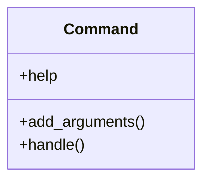

# core_modules.users_accounts.management.commands.system_report

## Imports
- datetime
- django.core.management.base
- os
- psutil
- xlsxwriter

## Classes
- Command
  - attr: `help`
  - method: `add_arguments`
  - method: `handle`

## Functions
- add_arguments
- handle

## Class Diagram

