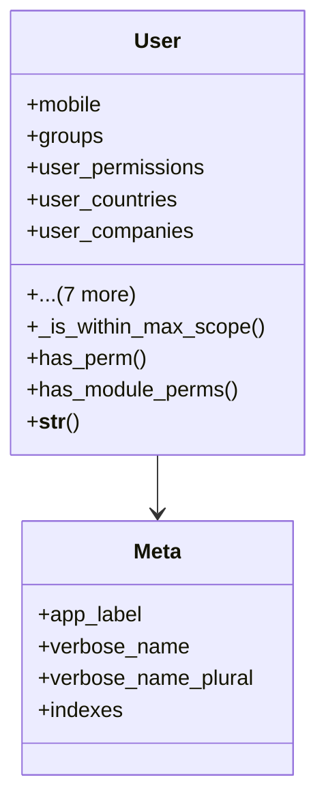

# core_modules.users_accounts.models

## Imports
- core_modules.organization.models
- core_modules.permissions_manager.models
- django.conf
- django.contrib.auth.models
- django.db
- django.utils
- django.utils.translation
- logging

## Classes
- User
  - attr: `mobile`
  - attr: `groups`
  - attr: `user_permissions`
  - attr: `user_countries`
  - attr: `user_companies`
  - attr: `user_branches`
  - attr: `PASSWORD_RESET_STATUS_CHOICES`
  - attr: `pending_password`
  - attr: `password_reset_status`
  - attr: `password_reset_requested_at`
  - attr: `password_reset_approved_at`
  - attr: `password_reset_approved_by`
  - method: `_is_within_max_scope`
  - method: `has_perm`
  - method: `has_module_perms`
  - method: `__str__`
- Meta
  - attr: `app_label`
  - attr: `verbose_name`
  - attr: `verbose_name_plural`
  - attr: `indexes`

## Functions
- _is_within_max_scope
- has_perm
- has_module_perms
- __str__

## Module Variables
- `logger`

## Class Diagram

