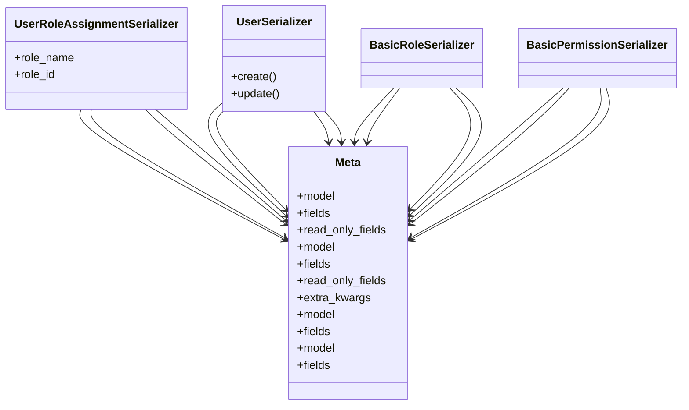

# core_modules.users_accounts.serializers

## Imports
- admin_modules.permissions_manager.models
- admin_modules.permissions_manager.serializers
- django.contrib.auth
- rest_framework

## Classes
- UserRoleAssignmentSerializer
  - attr: `role_name`
  - attr: `role_id`
- UserSerializer
  - method: `create`
  - method: `update`
- BasicRoleSerializer
- BasicPermissionSerializer
- Meta
  - attr: `model`
  - attr: `fields`
  - attr: `read_only_fields`
- Meta
  - attr: `model`
  - attr: `fields`
  - attr: `read_only_fields`
  - attr: `extra_kwargs`
- Meta
  - attr: `model`
  - attr: `fields`
- Meta
  - attr: `model`
  - attr: `fields`

## Functions
- create
- update

## Module Variables
- `User`

## Class Diagram

