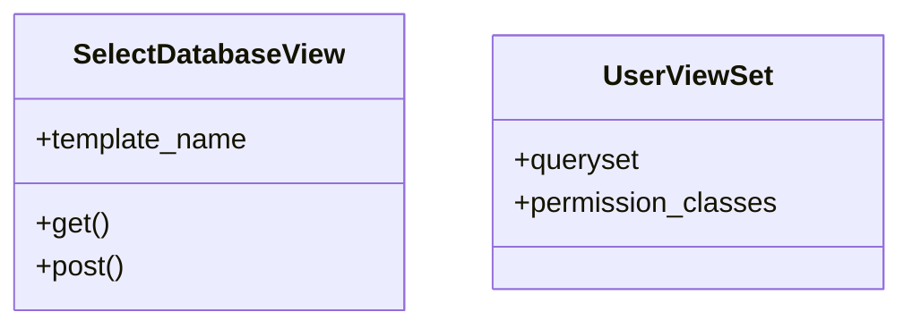

# core_modules.users_accounts.views

## Imports
- admin_modules.permissions_manager.models
- django.contrib
- django.contrib.auth
- django.contrib.auth.mixins
- django.shortcuts
- django.urls
- django.utils.translation
- django.views
- forms
- rest_framework
- services.core.models

## Classes
- SelectDatabaseView
  - attr: `template_name`
  - method: `get`
  - method: `post`
- UserViewSet
  - attr: `queryset`
  - attr: `permission_classes`

## Functions
- get
- post

## Module Variables
- `User`

## Class Diagram

