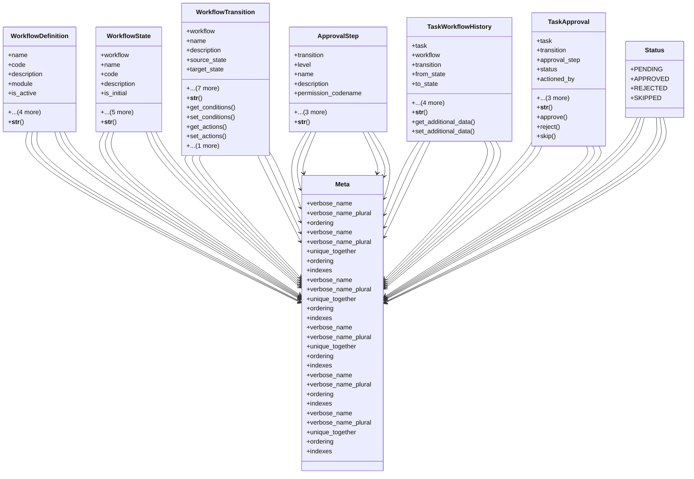

# core_modules.workflow

## Imports
- django.conf
- django.core.exceptions
- django.db
- django.utils
- django.utils.translation
- json
- task

## Classes
- WorkflowDefinition
  - attr: `name`
  - attr: `code`
  - attr: `description`
  - attr: `module`
  - attr: `is_active`
  - attr: `created_at`
  - attr: `updated_at`
  - attr: `created_by`
  - attr: `updated_by`
  - method: `__str__`
- WorkflowState
  - attr: `workflow`
  - attr: `name`
  - attr: `code`
  - attr: `description`
  - attr: `is_initial`
  - attr: `is_final`
  - attr: `ui_color`
  - attr: `ui_icon`
  - attr: `created_at`
  - attr: `updated_at`
  - method: `__str__`
- WorkflowTransition
  - attr: `workflow`
  - attr: `name`
  - attr: `description`
  - attr: `source_state`
  - attr: `target_state`
  - attr: `permission_codename`
  - attr: `conditions`
  - attr: `actions`
  - attr: `requires_approval`
  - attr: `approval_levels`
  - attr: `created_at`
  - attr: `updated_at`
  - method: `__str__`
  - method: `get_conditions`
  - method: `set_conditions`
  - method: `get_actions`
  - method: `set_actions`
  - method: `clean`
- ApprovalStep
  - attr: `transition`
  - attr: `level`
  - attr: `name`
  - attr: `description`
  - attr: `permission_codename`
  - attr: `skip_if_approver_is_creator`
  - attr: `created_at`
  - attr: `updated_at`
  - method: `__str__`
- TaskWorkflowHistory
  - attr: `task`
  - attr: `workflow`
  - attr: `transition`
  - attr: `from_state`
  - attr: `to_state`
  - attr: `executed_by`
  - attr: `executed_at`
  - attr: `comments`
  - attr: `additional_data`
  - method: `__str__`
  - method: `get_additional_data`
  - method: `set_additional_data`
- TaskApproval
  - attr: `task`
  - attr: `transition`
  - attr: `approval_step`
  - attr: `status`
  - attr: `actioned_by`
  - attr: `actioned_at`
  - attr: `comments`
  - attr: `created_at`
  - method: `__str__`
  - method: `approve`
  - method: `reject`
  - method: `skip`
- Meta
  - attr: `verbose_name`
  - attr: `verbose_name_plural`
  - attr: `ordering`
- Meta
  - attr: `verbose_name`
  - attr: `verbose_name_plural`
  - attr: `unique_together`
  - attr: `ordering`
  - attr: `indexes`
- Meta
  - attr: `verbose_name`
  - attr: `verbose_name_plural`
  - attr: `unique_together`
  - attr: `ordering`
  - attr: `indexes`
- Meta
  - attr: `verbose_name`
  - attr: `verbose_name_plural`
  - attr: `unique_together`
  - attr: `ordering`
  - attr: `indexes`
- Meta
  - attr: `verbose_name`
  - attr: `verbose_name_plural`
  - attr: `ordering`
  - attr: `indexes`
- Status
  - attr: `PENDING`
  - attr: `APPROVED`
  - attr: `REJECTED`
  - attr: `SKIPPED`
- Meta
  - attr: `verbose_name`
  - attr: `verbose_name_plural`
  - attr: `unique_together`
  - attr: `ordering`
  - attr: `indexes`

## Functions
- __str__
- __str__
- __str__
- get_conditions
- set_conditions
- get_actions
- set_actions
- clean
- __str__
- __str__
- get_additional_data
- set_additional_data
- __str__
- approve
- reject
- skip

## Class Diagram

