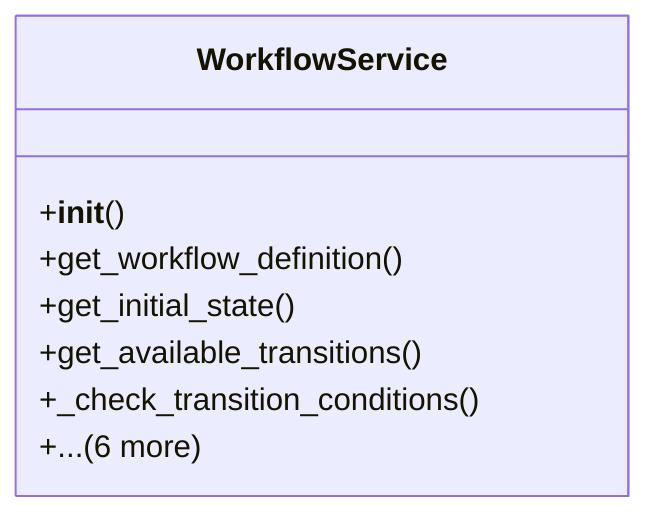

# core_modules.workflow_service

## Imports
- __future__
- core_modules.permissions.authorization_service
- django.core.exceptions
- django.db
- django.utils
- django.utils.translation
- json
- models.task
- models.task_notifications
- models.workflow
- task
- task_notifications
- typing
- workflow

## Classes
- WorkflowService
  - method: `__init__`
  - method: `get_workflow_definition`
  - method: `get_initial_state`
  - method: `get_available_transitions`
  - method: `_check_transition_conditions`
  - method: `initialize_workflow`
  - method: `execute_transition`
  - method: `_create_approval_steps`
  - method: `_notify_next_approvers`
  - method: `_execute_transition_actions`
  - method: `_send_transition_notifications`

## Functions
- __init__
- get_workflow_definition
- get_initial_state
- get_available_transitions
- _check_transition_conditions
- initialize_workflow
- execute_transition
- _create_approval_steps
- _notify_next_approvers
- _execute_transition_actions
- _send_transition_notifications
- _notify

## Class Diagram

