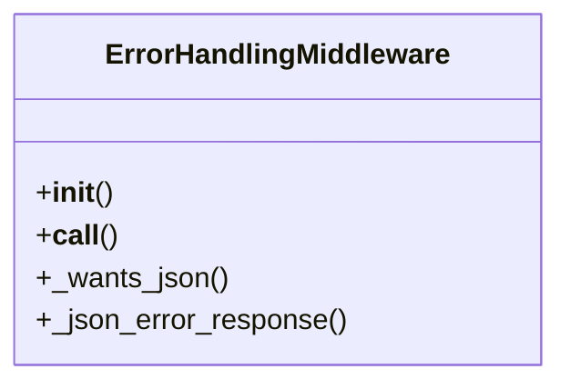

# gaara_erp.middleware.error_handling

## Imports
- django.conf
- django.core.exceptions
- django.http
- logging
- traceback
- typing
- uuid

## Classes
- ErrorHandlingMiddleware
  - method: `__init__`
  - method: `__call__`
  - method: `_wants_json`
  - method: `_json_error_response`

## Functions
- __init__
- __call__
- _wants_json
- _json_error_response

## Module Variables
- `logger`

## Class Diagram

