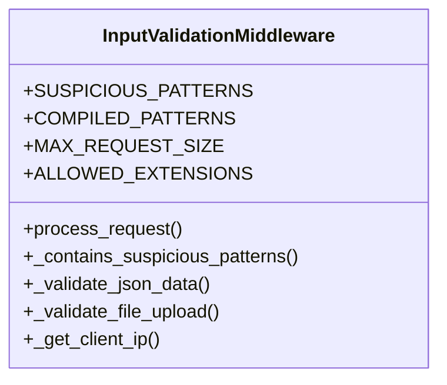

# gaara_erp.middleware.input_validation

## Imports
- django.conf
- django.http
- django.utils.deprecation
- json
- logging
- re

## Classes
- InputValidationMiddleware
  - attr: `SUSPICIOUS_PATTERNS`
  - attr: `COMPILED_PATTERNS`
  - attr: `MAX_REQUEST_SIZE`
  - attr: `ALLOWED_EXTENSIONS`
  - method: `process_request`
  - method: `_contains_suspicious_patterns`
  - method: `_validate_json_data`
  - method: `_validate_file_upload`
  - method: `_get_client_ip`

## Functions
- process_request
- _contains_suspicious_patterns
- _validate_json_data
- _validate_file_upload
- _get_client_ip

## Module Variables
- `logger`

## Class Diagram

