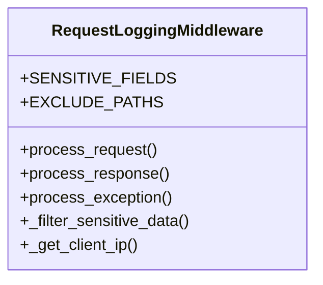

# gaara_erp.middleware.request_logging

## Imports
- django.conf
- django.utils.deprecation
- json
- logging
- time
- uuid

## Classes
- RequestLoggingMiddleware
  - attr: `SENSITIVE_FIELDS`
  - attr: `EXCLUDE_PATHS`
  - method: `process_request`
  - method: `process_response`
  - method: `process_exception`
  - method: `_filter_sensitive_data`
  - method: `_get_client_ip`

## Functions
- process_request
- process_response
- process_exception
- _filter_sensitive_data
- _get_client_ip

## Module Variables
- `logger`

## Class Diagram

