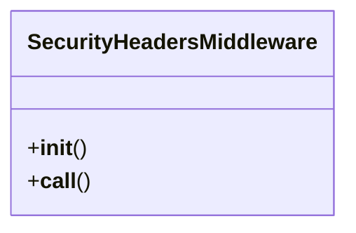

# gaara_erp.middleware.security_headers

## Imports
- django.conf

## Classes
- SecurityHeadersMiddleware
  - method: `__init__`
  - method: `__call__`

## Functions
- __init__
- __call__

## Class Diagram

