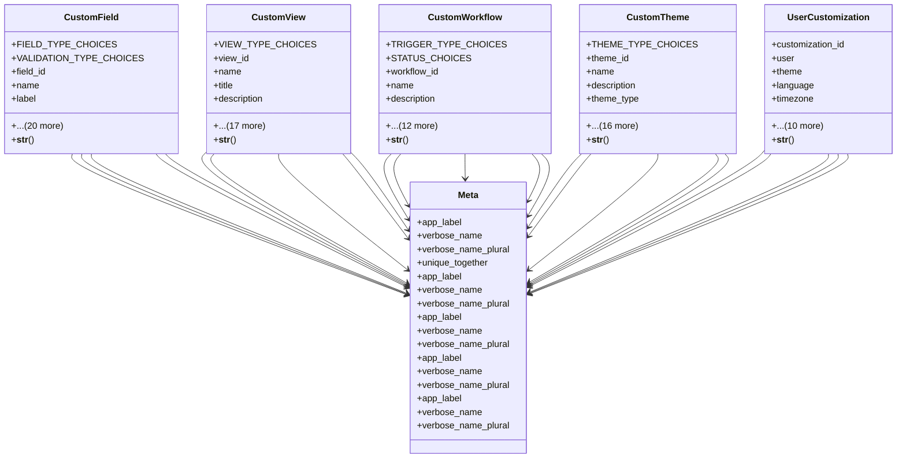

# helper_modules.customization.models

## Imports
- django.conf
- django.db
- django.utils
- django.utils.translation
- uuid

## Classes
- CustomField
  - attr: `FIELD_TYPE_CHOICES`
  - attr: `VALIDATION_TYPE_CHOICES`
  - attr: `field_id`
  - attr: `name`
  - attr: `label`
  - attr: `description`
  - attr: `field_type`
  - attr: `model_name`
  - attr: `app_label`
  - attr: `default_value`
  - attr: `choices`
  - attr: `help_text`
  - attr: `validation_type`
  - attr: `validation_value`
  - attr: `validation_message`
  - attr: `is_required`
  - attr: `is_visible`
  - attr: `is_searchable`
  - attr: `is_sortable`
  - attr: `order`
  - attr: `group`
  - attr: `is_active`
  - attr: `created_by`
  - attr: `created_at`
  - attr: `updated_at`
  - method: `__str__`
- CustomView
  - attr: `VIEW_TYPE_CHOICES`
  - attr: `view_id`
  - attr: `name`
  - attr: `title`
  - attr: `description`
  - attr: `view_type`
  - attr: `model_name`
  - attr: `app_label`
  - attr: `fields`
  - attr: `filters`
  - attr: `sorting`
  - attr: `grouping`
  - attr: `layout`
  - attr: `styling`
  - attr: `is_public`
  - attr: `allowed_users`
  - attr: `is_active`
  - attr: `is_default`
  - attr: `usage_count`
  - attr: `created_by`
  - attr: `created_at`
  - attr: `updated_at`
  - method: `__str__`
- CustomWorkflow
  - attr: `TRIGGER_TYPE_CHOICES`
  - attr: `STATUS_CHOICES`
  - attr: `workflow_id`
  - attr: `name`
  - attr: `description`
  - attr: `trigger_type`
  - attr: `trigger_conditions`
  - attr: `steps`
  - attr: `timeout`
  - attr: `retry_attempts`
  - attr: `status`
  - attr: `total_executions`
  - attr: `successful_executions`
  - attr: `failed_executions`
  - attr: `created_by`
  - attr: `created_at`
  - attr: `updated_at`
  - method: `__str__`
- CustomTheme
  - attr: `THEME_TYPE_CHOICES`
  - attr: `theme_id`
  - attr: `name`
  - attr: `description`
  - attr: `theme_type`
  - attr: `primary_color`
  - attr: `secondary_color`
  - attr: `success_color`
  - attr: `warning_color`
  - attr: `danger_color`
  - attr: `info_color`
  - attr: `font_family`
  - attr: `font_size`
  - attr: `sidebar_width`
  - attr: `header_height`
  - attr: `custom_css`
  - attr: `is_active`
  - attr: `is_default`
  - attr: `created_by`
  - attr: `created_at`
  - attr: `updated_at`
  - method: `__str__`
- UserCustomization
  - attr: `customization_id`
  - attr: `user`
  - attr: `theme`
  - attr: `language`
  - attr: `timezone`
  - attr: `items_per_page`
  - attr: `default_view`
  - attr: `dashboard_widgets`
  - attr: `dashboard_layout`
  - attr: `email_notifications`
  - attr: `push_notifications`
  - attr: `sms_notifications`
  - attr: `custom_settings`
  - attr: `created_at`
  - attr: `updated_at`
  - method: `__str__`
- Meta
  - attr: `app_label`
  - attr: `verbose_name`
  - attr: `verbose_name_plural`
  - attr: `unique_together`
- Meta
  - attr: `app_label`
  - attr: `verbose_name`
  - attr: `verbose_name_plural`
- Meta
  - attr: `app_label`
  - attr: `verbose_name`
  - attr: `verbose_name_plural`
- Meta
  - attr: `app_label`
  - attr: `verbose_name`
  - attr: `verbose_name_plural`
- Meta
  - attr: `app_label`
  - attr: `verbose_name`
  - attr: `verbose_name_plural`

## Functions
- __str__
- __str__
- __str__
- __str__
- __str__

## Class Diagram

