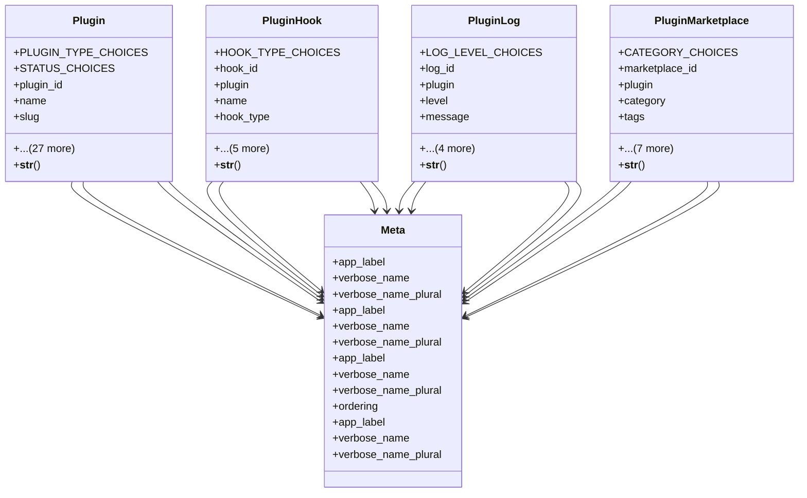

# helper_modules.plugins.models

## Imports
- decimal
- django.conf
- django.db
- django.utils
- django.utils.translation
- uuid

## Classes
- Plugin
  - attr: `PLUGIN_TYPE_CHOICES`
  - attr: `STATUS_CHOICES`
  - attr: `plugin_id`
  - attr: `name`
  - attr: `slug`
  - attr: `description`
  - attr: `plugin_type`
  - attr: `version`
  - attr: `author`
  - attr: `author_email`
  - attr: `website`
  - attr: `package_name`
  - attr: `install_path`
  - attr: `main_file`
  - attr: `requirements`
  - attr: `dependencies`
  - attr: `min_system_version`
  - attr: `configuration`
  - attr: `default_settings`
  - attr: `status`
  - attr: `is_system_plugin`
  - attr: `requires_restart`
  - attr: `license`
  - attr: `is_free`
  - attr: `price`
  - attr: `download_count`
  - attr: `rating`
  - attr: `review_count`
  - attr: `installed_at`
  - attr: `installed_by`
  - attr: `created_at`
  - attr: `updated_at`
  - method: `__str__`
- PluginHook
  - attr: `HOOK_TYPE_CHOICES`
  - attr: `hook_id`
  - attr: `plugin`
  - attr: `name`
  - attr: `hook_type`
  - attr: `callback_function`
  - attr: `priority`
  - attr: `conditions`
  - attr: `is_active`
  - attr: `created_at`
  - method: `__str__`
- PluginLog
  - attr: `LOG_LEVEL_CHOICES`
  - attr: `log_id`
  - attr: `plugin`
  - attr: `level`
  - attr: `message`
  - attr: `details`
  - attr: `function_name`
  - attr: `line_number`
  - attr: `created_at`
  - method: `__str__`
- PluginMarketplace
  - attr: `CATEGORY_CHOICES`
  - attr: `marketplace_id`
  - attr: `plugin`
  - attr: `category`
  - attr: `tags`
  - attr: `screenshots`
  - attr: `featured`
  - attr: `promoted`
  - attr: `views`
  - attr: `downloads_this_month`
  - attr: `published_at`
  - attr: `last_updated`
  - method: `__str__`
- Meta
  - attr: `app_label`
  - attr: `verbose_name`
  - attr: `verbose_name_plural`
- Meta
  - attr: `app_label`
  - attr: `verbose_name`
  - attr: `verbose_name_plural`
- Meta
  - attr: `app_label`
  - attr: `verbose_name`
  - attr: `verbose_name_plural`
  - attr: `ordering`
- Meta
  - attr: `app_label`
  - attr: `verbose_name`
  - attr: `verbose_name_plural`

## Functions
- __str__
- __str__
- __str__
- __str__

## Class Diagram

