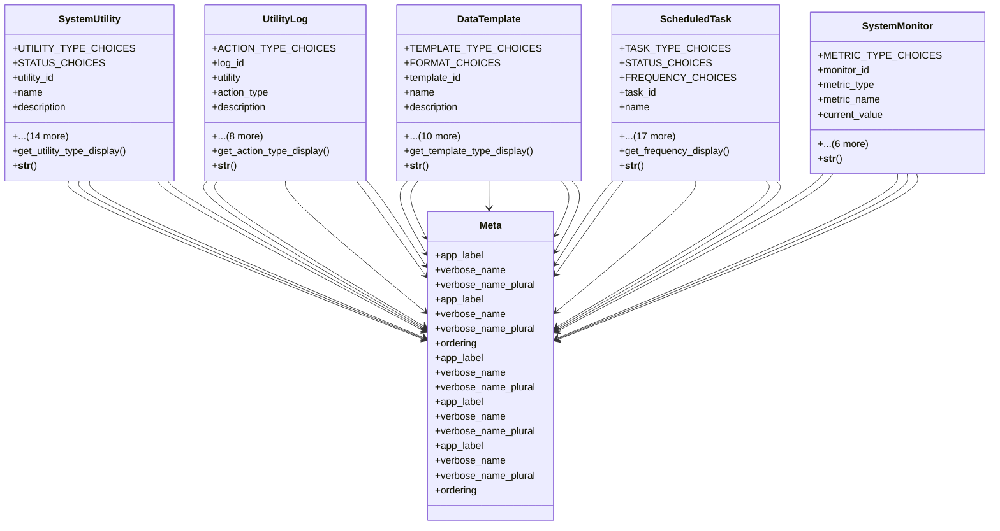

# helper_modules.utilities.models

## Imports
- django.conf
- django.db
- django.utils
- django.utils.translation
- typing
- uuid

## Classes
- SystemUtility
  - attr: `UTILITY_TYPE_CHOICES`
  - attr: `STATUS_CHOICES`
  - attr: `utility_id`
  - attr: `name`
  - attr: `description`
  - attr: `utility_type`
  - attr: `version`
  - attr: `author`
  - attr: `icon`
  - attr: `is_public`
  - attr: `requires_permission`
  - attr: `permission_name`
  - attr: `status`
  - attr: `configuration`
  - attr: `usage_count`
  - attr: `last_used`
  - attr: `created_by`
  - attr: `created_at`
  - attr: `updated_at`
  - method: `get_utility_type_display`
  - method: `__str__`
- UtilityLog
  - attr: `ACTION_TYPE_CHOICES`
  - attr: `log_id`
  - attr: `utility`
  - attr: `action_type`
  - attr: `description`
  - attr: `input_data`
  - attr: `output_data`
  - attr: `execution_time`
  - attr: `memory_usage`
  - attr: `user`
  - attr: `session_id`
  - attr: `ip_address`
  - attr: `created_at`
  - method: `get_action_type_display`
  - method: `__str__`
- DataTemplate
  - attr: `TEMPLATE_TYPE_CHOICES`
  - attr: `FORMAT_CHOICES`
  - attr: `template_id`
  - attr: `name`
  - attr: `description`
  - attr: `template_type`
  - attr: `format`
  - attr: `template_content`
  - attr: `sample_data`
  - attr: `is_default`
  - attr: `is_system`
  - attr: `usage_count`
  - attr: `created_by`
  - attr: `created_at`
  - attr: `updated_at`
  - method: `get_template_type_display`
  - method: `__str__`
- ScheduledTask
  - attr: `TASK_TYPE_CHOICES`
  - attr: `STATUS_CHOICES`
  - attr: `FREQUENCY_CHOICES`
  - attr: `task_id`
  - attr: `name`
  - attr: `description`
  - attr: `task_type`
  - attr: `frequency`
  - attr: `cron_expression`
  - attr: `next_run`
  - attr: `command`
  - attr: `parameters`
  - attr: `timeout`
  - attr: `status`
  - attr: `last_run`
  - attr: `last_result`
  - attr: `total_runs`
  - attr: `successful_runs`
  - attr: `failed_runs`
  - attr: `created_by`
  - attr: `created_at`
  - attr: `updated_at`
  - method: `get_frequency_display`
  - method: `__str__`
- SystemMonitor
  - attr: `METRIC_TYPE_CHOICES`
  - attr: `monitor_id`
  - attr: `metric_type`
  - attr: `metric_name`
  - attr: `current_value`
  - attr: `previous_value`
  - attr: `threshold_warning`
  - attr: `threshold_critical`
  - attr: `unit`
  - attr: `details`
  - attr: `recorded_at`
  - method: `__str__`
- Meta
  - attr: `app_label`
  - attr: `verbose_name`
  - attr: `verbose_name_plural`
- Meta
  - attr: `app_label`
  - attr: `verbose_name`
  - attr: `verbose_name_plural`
  - attr: `ordering`
- Meta
  - attr: `app_label`
  - attr: `verbose_name`
  - attr: `verbose_name_plural`
- Meta
  - attr: `app_label`
  - attr: `verbose_name`
  - attr: `verbose_name_plural`
- Meta
  - attr: `app_label`
  - attr: `verbose_name`
  - attr: `verbose_name_plural`
  - attr: `ordering`

## Functions
- get_utility_type_display
- __str__
- get_action_type_display
- __str__
- get_template_type_display
- __str__
- get_frequency_display
- __str__
- __str__

## Class Diagram

