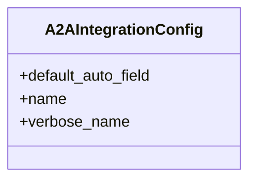

# integration_modules.a2a_integration.apps

## Imports
- django.apps

## Classes
- A2AIntegrationConfig
  - attr: `default_auto_field`
  - attr: `name`
  - attr: `verbose_name`

## Class Diagram

```mermaid
classDiagram
    class A2AIntegrationConfig {
        +default_auto_field
        +name
        +verbose_name
    }
```
