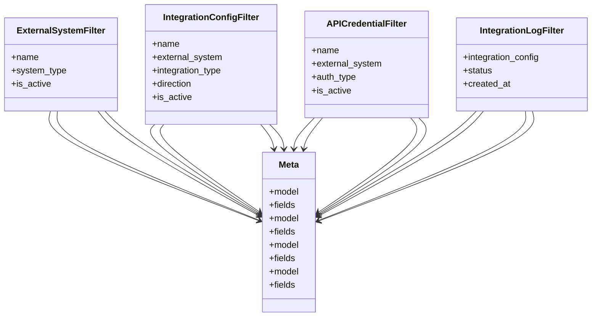

# integration_modules.a2a_integration.filters

## Imports
- django_filters
- models

## Classes
- ExternalSystemFilter
  - attr: `name`
  - attr: `system_type`
  - attr: `is_active`
- IntegrationConfigFilter
  - attr: `name`
  - attr: `external_system`
  - attr: `integration_type`
  - attr: `direction`
  - attr: `is_active`
- APICredentialFilter
  - attr: `name`
  - attr: `external_system`
  - attr: `auth_type`
  - attr: `is_active`
- IntegrationLogFilter
  - attr: `integration_config`
  - attr: `status`
  - attr: `created_at`
- Meta
  - attr: `model`
  - attr: `fields`
- Meta
  - attr: `model`
  - attr: `fields`
- Meta
  - attr: `model`
  - attr: `fields`
- Meta
  - attr: `model`
  - attr: `fields`

## Class Diagram

