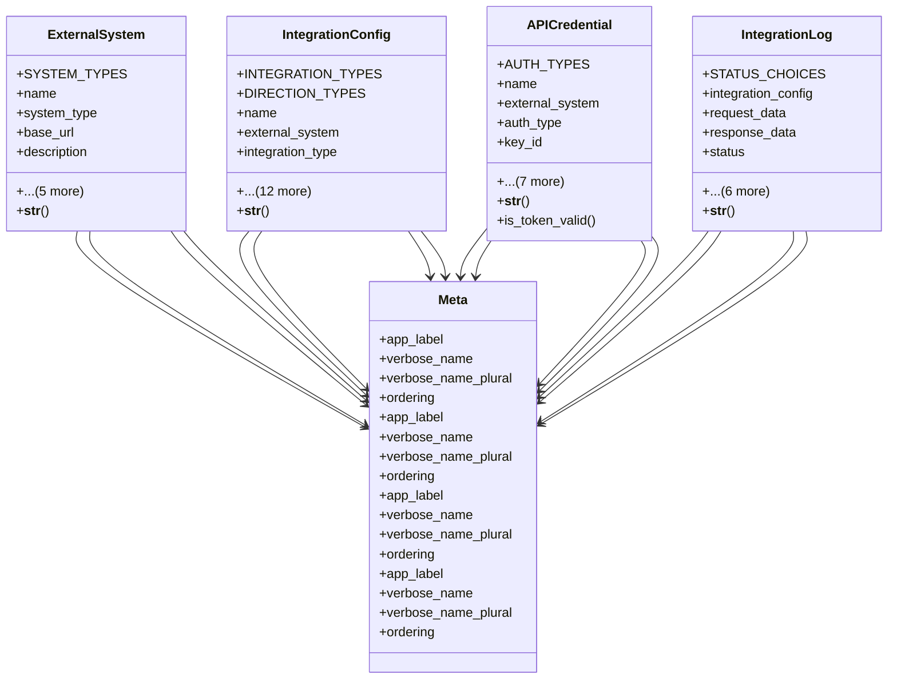

# integration_modules.a2a_integration.models

## Imports
- django.conf
- django.db
- django.utils
- django.utils.translation

## Classes
- ExternalSystem
  - attr: `SYSTEM_TYPES`
  - attr: `name`
  - attr: `system_type`
  - attr: `base_url`
  - attr: `description`
  - attr: `contact_person`
  - attr: `contact_email`
  - attr: `is_active`
  - attr: `created_at`
  - attr: `updated_at`
  - method: `__str__`
- IntegrationConfig
  - attr: `INTEGRATION_TYPES`
  - attr: `DIRECTION_TYPES`
  - attr: `name`
  - attr: `external_system`
  - attr: `integration_type`
  - attr: `direction`
  - attr: `endpoint_url`
  - attr: `data_format`
  - attr: `headers`
  - attr: `parameters`
  - attr: `schedule`
  - attr: `retry_count`
  - attr: `retry_delay`
  - attr: `timeout`
  - attr: `is_active`
  - attr: `created_at`
  - attr: `updated_at`
  - method: `__str__`
- APICredential
  - attr: `AUTH_TYPES`
  - attr: `name`
  - attr: `external_system`
  - attr: `auth_type`
  - attr: `key_id`
  - attr: `key_secret`
  - attr: `token`
  - attr: `token_expiry`
  - attr: `additional_data`
  - attr: `is_active`
  - attr: `created_at`
  - attr: `updated_at`
  - method: `__str__`
  - method: `is_token_valid`
- IntegrationLog
  - attr: `STATUS_CHOICES`
  - attr: `integration_config`
  - attr: `request_data`
  - attr: `response_data`
  - attr: `status`
  - attr: `status_code`
  - attr: `error_message`
  - attr: `execution_time`
  - attr: `retry_count`
  - attr: `created_by`
  - attr: `created_at`
  - method: `__str__`
- Meta
  - attr: `app_label`
  - attr: `verbose_name`
  - attr: `verbose_name_plural`
  - attr: `ordering`
- Meta
  - attr: `app_label`
  - attr: `verbose_name`
  - attr: `verbose_name_plural`
  - attr: `ordering`
- Meta
  - attr: `app_label`
  - attr: `verbose_name`
  - attr: `verbose_name_plural`
  - attr: `ordering`
- Meta
  - attr: `app_label`
  - attr: `verbose_name`
  - attr: `verbose_name_plural`
  - attr: `ordering`

## Functions
- __str__
- __str__
- __str__
- is_token_valid
- __str__

## Module Variables
- `__all__`

## Class Diagram

