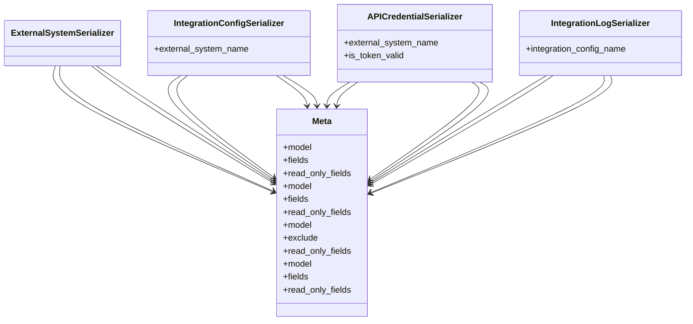

# integration_modules.a2a_integration.serializers

## Imports
- models
- rest_framework

## Classes
- ExternalSystemSerializer
- IntegrationConfigSerializer
  - attr: `external_system_name`
- APICredentialSerializer
  - attr: `external_system_name`
  - attr: `is_token_valid`
- IntegrationLogSerializer
  - attr: `integration_config_name`
- Meta
  - attr: `model`
  - attr: `fields`
  - attr: `read_only_fields`
- Meta
  - attr: `model`
  - attr: `fields`
  - attr: `read_only_fields`
- Meta
  - attr: `model`
  - attr: `exclude`
  - attr: `read_only_fields`
- Meta
  - attr: `model`
  - attr: `fields`
  - attr: `read_only_fields`

## Class Diagram

