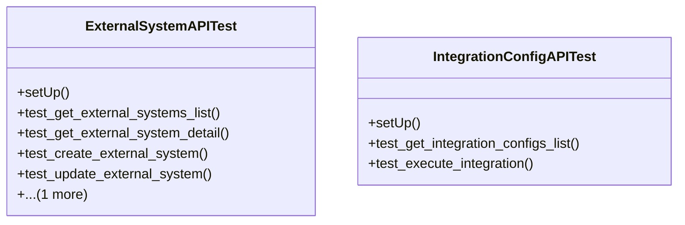

# integration_modules.a2a_integration.tests.test_api

## Imports
- django.contrib.auth
- django.test
- django.urls
- models
- rest_framework
- rest_framework.test

## Classes
- ExternalSystemAPITest
  - method: `setUp`
  - method: `test_get_external_systems_list`
  - method: `test_get_external_system_detail`
  - method: `test_create_external_system`
  - method: `test_update_external_system`
  - method: `test_delete_external_system`
- IntegrationConfigAPITest
  - method: `setUp`
  - method: `test_get_integration_configs_list`
  - method: `test_execute_integration`

## Functions
- setUp
- test_get_external_systems_list
- test_get_external_system_detail
- test_create_external_system
- test_update_external_system
- test_delete_external_system
- setUp
- test_get_integration_configs_list
- test_execute_integration

## Class Diagram

