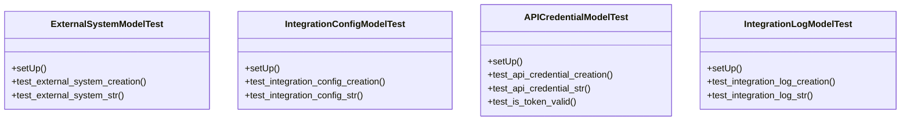

# integration_modules.a2a_integration.tests.test_models

## Imports
- datetime
- django.contrib.auth
- django.test
- django.utils
- models

## Classes
- ExternalSystemModelTest
  - method: `setUp`
  - method: `test_external_system_creation`
  - method: `test_external_system_str`
- IntegrationConfigModelTest
  - method: `setUp`
  - method: `test_integration_config_creation`
  - method: `test_integration_config_str`
- APICredentialModelTest
  - method: `setUp`
  - method: `test_api_credential_creation`
  - method: `test_api_credential_str`
  - method: `test_is_token_valid`
- IntegrationLogModelTest
  - method: `setUp`
  - method: `test_integration_log_creation`
  - method: `test_integration_log_str`

## Functions
- setUp
- test_external_system_creation
- test_external_system_str
- setUp
- test_integration_config_creation
- test_integration_config_str
- setUp
- test_api_credential_creation
- test_api_credential_str
- test_is_token_valid
- setUp
- test_integration_log_creation
- test_integration_log_str

## Class Diagram

