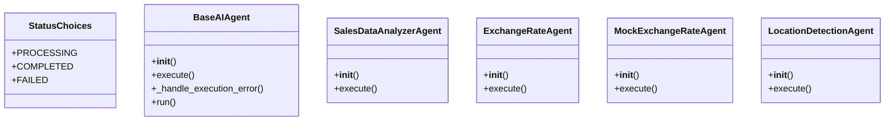

# integration_modules.ai.agents

## Imports
- abc
- datetime
- django.conf
- django.contrib.auth
- django.utils
- exceptions
- forex_python.converter
- langfuse
- langfuse.model
- logging
- os
- time
- traceback

## Classes
- StatusChoices
  - attr: `PROCESSING`
  - attr: `COMPLETED`
  - attr: `FAILED`
- BaseAIAgent
  - method: `__init__`
  - method: `execute`
  - method: `_handle_execution_error`
  - method: `run`
- SalesDataAnalyzerAgent
  - method: `__init__`
  - method: `execute`
- ExchangeRateAgent
  - method: `__init__`
  - method: `execute`
- MockExchangeRateAgent
  - method: `__init__`
  - method: `execute`
- LocationDetectionAgent
  - method: `__init__`
  - method: `execute`

## Functions
- log_system_error
- __init__
- execute
- _handle_execution_error
- run
- __init__
- execute
- __init__
- execute
- __init__
- execute
- __init__
- execute

## Module Variables
- `logger`
- `User`

## Class Diagram

