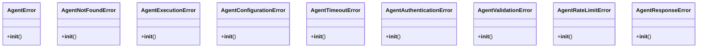

# integration_modules.ai.exceptions

## Imports
- typing

## Classes
- AgentError
  - method: `__init__`
- AgentNotFoundError
  - method: `__init__`
- AgentExecutionError
  - method: `__init__`
- AgentConfigurationError
  - method: `__init__`
- AgentTimeoutError
  - method: `__init__`
- AgentAuthenticationError
  - method: `__init__`
- AgentValidationError
  - method: `__init__`
- AgentRateLimitError
  - method: `__init__`
- AgentResponseError
  - method: `__init__`

## Functions
- __init__
- __init__
- __init__
- __init__
- __init__
- __init__
- __init__
- __init__
- __init__

## Class Diagram

