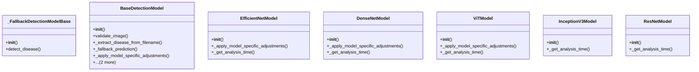

# integration_modules.ai.models.additional_models

## Imports
- abc
- detection_models
- disease_mappings
- logging
- os
- random
- typing

## Classes
- _FallbackDetectionModelBase
  - method: `__init__`
  - method: `detect_disease`
- BaseDetectionModel
  - method: `__init__`
  - method: `validate_image`
  - method: `_extract_disease_from_filename`
  - method: `_fallback_prediction`
  - method: `_apply_model_specific_adjustments`
  - method: `_get_analysis_time`
  - method: `detect_disease`
- EfficientNetModel
  - method: `__init__`
  - method: `_apply_model_specific_adjustments`
  - method: `_get_analysis_time`
- DenseNetModel
  - method: `__init__`
  - method: `_apply_model_specific_adjustments`
  - method: `_get_analysis_time`
- ViTModel
  - method: `__init__`
  - method: `_apply_model_specific_adjustments`
  - method: `_get_analysis_time`
- InceptionV3Model
  - method: `__init__`
  - method: `_get_analysis_time`
- ResNetModel
  - method: `__init__`
  - method: `_get_analysis_time`

## Functions
- get_model_by_name
- get_available_models
- get_models_info
- __init__
- detect_disease
- __init__
- validate_image
- _extract_disease_from_filename
- _fallback_prediction
- _apply_model_specific_adjustments
- _get_analysis_time
- detect_disease
- __init__
- _apply_model_specific_adjustments
- _get_analysis_time
- __init__
- _apply_model_specific_adjustments
- _get_analysis_time
- __init__
- _apply_model_specific_adjustments
- _get_analysis_time
- __init__
- _get_analysis_time
- __init__
- _get_analysis_time

## Module Variables
- `logger`
- `AVAILABLE_MODELS`

## Class Diagram

