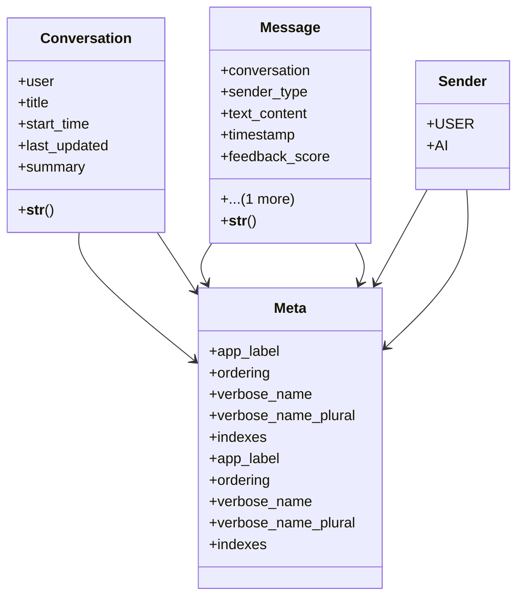

# integration_modules.ai.models.conversations

## Imports
- django.conf
- django.db
- django.utils
- django.utils.translation

## Classes
- Conversation
  - attr: `user`
  - attr: `title`
  - attr: `start_time`
  - attr: `last_updated`
  - attr: `summary`
  - method: `__str__`
- Message
  - attr: `conversation`
  - attr: `sender_type`
  - attr: `text_content`
  - attr: `timestamp`
  - attr: `feedback_score`
  - attr: `feedback_notes`
  - method: `__str__`
- Meta
  - attr: `app_label`
  - attr: `ordering`
  - attr: `verbose_name`
  - attr: `verbose_name_plural`
  - attr: `indexes`
- Sender
  - attr: `USER`
  - attr: `AI`
- Meta
  - attr: `app_label`
  - attr: `ordering`
  - attr: `verbose_name`
  - attr: `verbose_name_plural`
  - attr: `indexes`

## Functions
- __str__
- __str__

## Class Diagram

