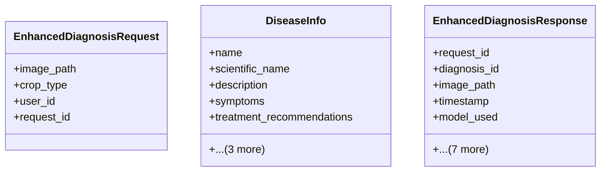

# integration_modules.ai.models.enhanced_ai_models

## Imports
- additional_models
- datetime
- detection_models
- django.db
- pydantic
- sys
- typing

## Classes
- EnhancedDiagnosisRequest
  - attr: `image_path`
  - attr: `crop_type`
  - attr: `user_id`
  - attr: `request_id`
- DiseaseInfo
  - attr: `name`
  - attr: `scientific_name`
  - attr: `description`
  - attr: `symptoms`
  - attr: `treatment_recommendations`
  - attr: `prevention_tips`
  - attr: `severity_level`
  - attr: `affected_parts`
- EnhancedDiagnosisResponse
  - attr: `request_id`
  - attr: `diagnosis_id`
  - attr: `image_path`
  - attr: `timestamp`
  - attr: `model_used`
  - attr: `detected_disease`
  - attr: `confidence_score`
  - attr: `alternative_diagnoses`
  - attr: `is_healthy`
  - attr: `processing_time_ms`
  - attr: `error_message`
  - attr: `status`

## Functions
- get_enhanced_models
- get_enhanced_model

## Module Variables
- `_enhanced_models`

## Class Diagram

