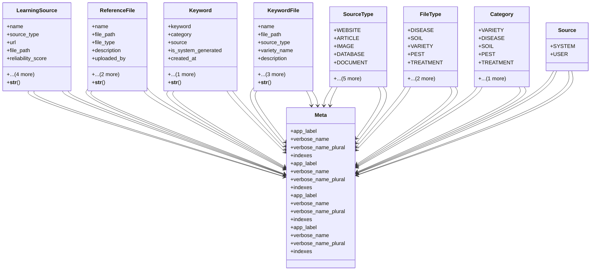

# integration_modules.ai.models.learning_sources

## Imports
- django.conf
- django.db
- django.utils.translation

## Classes
- LearningSource
  - attr: `name`
  - attr: `source_type`
  - attr: `url`
  - attr: `file_path`
  - attr: `reliability_score`
  - attr: `description`
  - attr: `is_active`
  - attr: `created_at`
  - attr: `updated_at`
  - method: `__str__`
- ReferenceFile
  - attr: `name`
  - attr: `file_path`
  - attr: `file_type`
  - attr: `description`
  - attr: `uploaded_by`
  - attr: `created_at`
  - attr: `updated_at`
  - method: `__str__`
- Keyword
  - attr: `keyword`
  - attr: `category`
  - attr: `source`
  - attr: `is_system_generated`
  - attr: `created_at`
  - attr: `updated_at`
  - method: `__str__`
- KeywordFile
  - attr: `name`
  - attr: `file_path`
  - attr: `source_type`
  - attr: `variety_name`
  - attr: `description`
  - attr: `uploaded_by`
  - attr: `created_at`
  - attr: `updated_at`
  - method: `__str__`
- SourceType
  - attr: `WEBSITE`
  - attr: `ARTICLE`
  - attr: `IMAGE`
  - attr: `DATABASE`
  - attr: `DOCUMENT`
  - attr: `USER_INPUT`
  - attr: `RESEARCH_PAPER`
  - attr: `SEED_COMPANY`
  - attr: `FERTILIZER_COMPANY`
  - attr: `RESEARCH_LAB`
- Meta
  - attr: `app_label`
  - attr: `verbose_name`
  - attr: `verbose_name_plural`
  - attr: `indexes`
- FileType
  - attr: `DISEASE`
  - attr: `SOIL`
  - attr: `VARIETY`
  - attr: `PEST`
  - attr: `TREATMENT`
  - attr: `STANDARD_SPEC`
  - attr: `GENERAL`
- Meta
  - attr: `app_label`
  - attr: `verbose_name`
  - attr: `verbose_name_plural`
  - attr: `indexes`
- Category
  - attr: `VARIETY`
  - attr: `DISEASE`
  - attr: `SOIL`
  - attr: `PEST`
  - attr: `TREATMENT`
  - attr: `GENERAL`
- Meta
  - attr: `app_label`
  - attr: `verbose_name`
  - attr: `verbose_name_plural`
  - attr: `indexes`
- Source
  - attr: `SYSTEM`
  - attr: `USER`
- Meta
  - attr: `app_label`
  - attr: `verbose_name`
  - attr: `verbose_name_plural`
  - attr: `indexes`

## Functions
- __str__
- __str__
- __str__
- __str__

## Class Diagram

