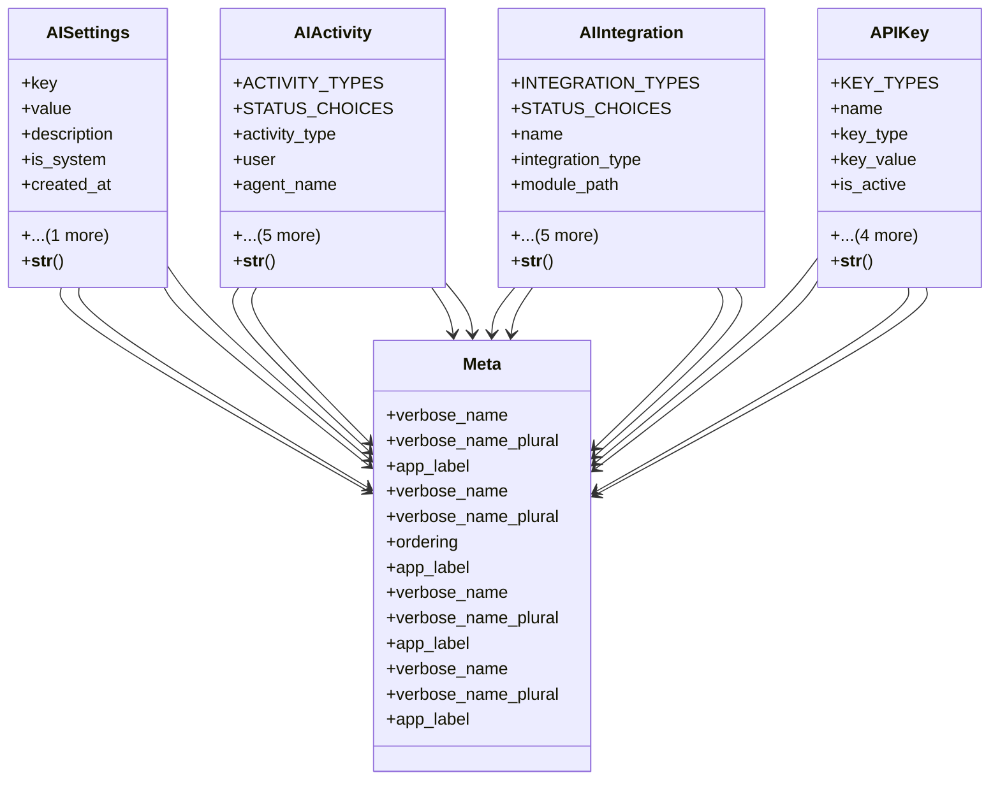

# integration_modules.ai.models

## Imports
- django.conf
- django.db
- django.db.models
- django.utils
- django.utils.translation
- models
- models.conversations
- models.learning_sources
- models.memory_and_learning

## Classes
- AISettings
  - attr: `key`
  - attr: `value`
  - attr: `description`
  - attr: `is_system`
  - attr: `created_at`
  - attr: `updated_at`
  - method: `__str__`
- AIActivity
  - attr: `ACTIVITY_TYPES`
  - attr: `STATUS_CHOICES`
  - attr: `activity_type`
  - attr: `user`
  - attr: `agent_name`
  - attr: `service_name`
  - attr: `action`
  - attr: `details`
  - attr: `status`
  - attr: `created_at`
  - method: `__str__`
- AIIntegration
  - attr: `INTEGRATION_TYPES`
  - attr: `STATUS_CHOICES`
  - attr: `name`
  - attr: `integration_type`
  - attr: `module_path`
  - attr: `configuration`
  - attr: `status`
  - attr: `last_sync`
  - attr: `created_at`
  - attr: `updated_at`
  - method: `__str__`
- APIKey
  - attr: `KEY_TYPES`
  - attr: `name`
  - attr: `key_type`
  - attr: `key_value`
  - attr: `is_active`
  - attr: `description`
  - attr: `expires_at`
  - attr: `created_at`
  - attr: `created_by`
  - method: `__str__`
- Meta
  - attr: `verbose_name`
  - attr: `verbose_name_plural`
  - attr: `app_label`
- Meta
  - attr: `verbose_name`
  - attr: `verbose_name_plural`
  - attr: `ordering`
  - attr: `app_label`
- Meta
  - attr: `verbose_name`
  - attr: `verbose_name_plural`
  - attr: `app_label`
- Meta
  - attr: `verbose_name`
  - attr: `verbose_name_plural`
  - attr: `app_label`

## Functions
- __str__
- __str__
- __str__
- __str__

## Class Diagram

