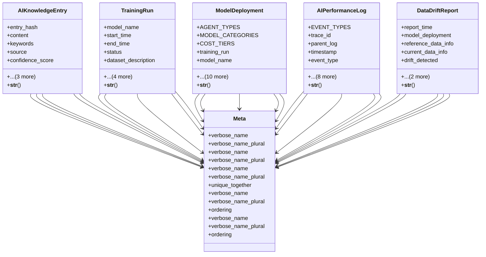

# integration_modules.ai.models.memory_and_learning

## Imports
- django.contrib.auth.models
- django.db
- django.db.models
- django.utils
- django.utils.translation
- learning_sources

## Classes
- AIKnowledgeEntry
  - attr: `entry_hash`
  - attr: `content`
  - attr: `keywords`
  - attr: `source`
  - attr: `confidence_score`
  - attr: `related_product`
  - attr: `created_at`
  - attr: `updated_at`
  - method: `__str__`
- TrainingRun
  - attr: `model_name`
  - attr: `start_time`
  - attr: `end_time`
  - attr: `status`
  - attr: `dataset_description`
  - attr: `hyperparameters`
  - attr: `metrics`
  - attr: `trained_model_path`
  - attr: `notes`
  - method: `__str__`
- ModelDeployment
  - attr: `AGENT_TYPES`
  - attr: `MODEL_CATEGORIES`
  - attr: `COST_TIERS`
  - attr: `training_run`
  - attr: `model_name`
  - attr: `version`
  - attr: `agent_type`
  - attr: `model_category`
  - attr: `cost_tier`
  - attr: `performance_rating`
  - attr: `deployment_time`
  - attr: `endpoint_url`
  - attr: `capabilities`
  - attr: `is_active`
  - attr: `description`
  - method: `__str__`
- AIPerformanceLog
  - attr: `EVENT_TYPES`
  - attr: `trace_id`
  - attr: `parent_log`
  - attr: `timestamp`
  - attr: `event_type`
  - attr: `acting_agent`
  - attr: `target_agent`
  - attr: `input_data`
  - attr: `output_data`
  - attr: `metadata`
  - attr: `latency_ms`
  - attr: `status`
  - attr: `error_message`
  - method: `__str__`
- DataDriftReport
  - attr: `report_time`
  - attr: `model_deployment`
  - attr: `reference_data_info`
  - attr: `current_data_info`
  - attr: `drift_detected`
  - attr: `drift_details`
  - attr: `report_file_path`
  - method: `__str__`
- Meta
  - attr: `verbose_name`
  - attr: `verbose_name_plural`
- Meta
  - attr: `verbose_name`
  - attr: `verbose_name_plural`
- Meta
  - attr: `verbose_name`
  - attr: `verbose_name_plural`
  - attr: `unique_together`
- Meta
  - attr: `verbose_name`
  - attr: `verbose_name_plural`
  - attr: `ordering`
- Meta
  - attr: `verbose_name`
  - attr: `verbose_name_plural`
  - attr: `ordering`

## Functions
- __str__
- __str__
- __str__
- __str__
- __str__

## Class Diagram

