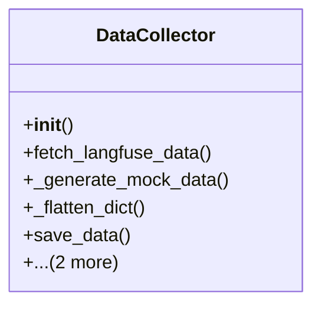

# integration_modules.ai.monitoring.data_collector

## Imports
- datetime
- django.utils
- json
- logging
- os
- pandas
- time
- typing

## Classes
- DataCollector
  - method: `__init__`
  - method: `fetch_langfuse_data`
  - method: `_generate_mock_data`
  - method: `_flatten_dict`
  - method: `save_data`
  - method: `run_collection_job`
  - method: `get_collection_stats`

## Functions
- fetch_langfuse_data
- save_data
- run_collection_job
- __init__
- fetch_langfuse_data
- _generate_mock_data
- _flatten_dict
- save_data
- run_collection_job
- get_collection_stats

## Module Variables
- `logger`

## Class Diagram

