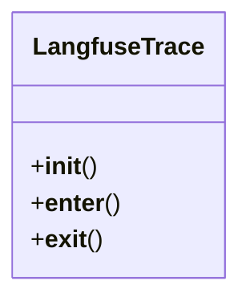

# integration_modules.ai.monitoring

## Imports
- atexit
- django.conf
- langfuse
- logging
- utilities.utils

## Classes
- LangfuseTrace
  - method: `__init__`
  - method: `__enter__`
  - method: `__exit__`

## Functions
- get_langfuse_client
- schedule_drift_detection_task
- start_trace
- start_span
- log_generation
- log_event
- score_trace
- shutdown_langfuse
- trace_function
- __init__
- __enter__
- __exit__
- decorator
- log_system_error
- wrapper

## Module Variables
- `logger`
- `langfuse_client`

## Class Diagram

