# integration_modules.ai.serializers

## Imports
- models
- rest_framework

## Classes
- MessageSerializer
- ConversationSerializer
  - attr: `messages`
- ConversationListSerializer
- LearningSourceSerializer
- ReferenceFileSerializer
- KeywordSerializer
- AIKnowledgeEntrySerializer
- TrainingRunSerializer
- ModelDeploymentSerializer
- AIPerformanceLogSerializer
- DataDriftReportSerializer
- KeywordFileSerializer
- A2ARequestSerializer
  - attr: `target_agent_name`
  - attr: `target_agent_version`
  - attr: `capability`
  - attr: `payload`
- A2AResponseSerializer
  - attr: `status`
  - attr: `result`
  - attr: `error_message`
- Meta
  - attr: `model`
  - attr: `fields`
- Meta
  - attr: `model`
  - attr: `fields`
  - attr: `read_only_fields`
- Meta
  - attr: `model`
  - attr: `fields`
  - attr: `read_only_fields`
- Meta
  - attr: `model`
  - attr: `fields`
- Meta
  - attr: `model`
  - attr: `fields`
- Meta
  - attr: `model`
  - attr: `fields`
- Meta
  - attr: `model`
  - attr: `fields`
- Meta
  - attr: `model`
  - attr: `fields`
- Meta
  - attr: `model`
  - attr: `fields`
- Meta
  - attr: `model`
  - attr: `fields`
- Meta
  - attr: `model`
  - attr: `fields`
- Meta
  - attr: `model`
  - attr: `fields`

## Class Diagram

```mermaid
classDiagram
    class MessageSerializer {
    }
    class ConversationSerializer {
        +messages
    }
    class ConversationListSerializer {
    }
    class LearningSourceSerializer {
    }
    class ReferenceFileSerializer {
    }
    class KeywordSerializer {
    }
    class AIKnowledgeEntrySerializer {
    }
    class TrainingRunSerializer {
    }
    class ModelDeploymentSerializer {
    }
    class AIPerformanceLogSerializer {
    }
    class DataDriftReportSerializer {
    }
    class KeywordFileSerializer {
    }
    class A2ARequestSerializer {
        +target_agent_name
        +target_agent_version
        +capability
        +payload
    }
    class A2AResponseSerializer {
        +status
        +result
        +error_message
    }
    class Meta {
        +model
        +fields
    }
    class Meta {
        +model
        +fields
        +read_only_fields
    }
    class Meta {
        +model
        +fields
        +read_only_fields
    }
    class Meta {
        +model
        +fields
    }
    class Meta {
        +model
        +fields
    }
    class Meta {
        +model
        +fields
    }
    class Meta {
        +model
        +fields
    }
    class Meta {
        +model
        +fields
    }
    class Meta {
        +model
        +fields
    }
    class Meta {
        +model
        +fields
    }
    class Meta {
        +model
        +fields
    }
    class Meta {
        +model
        +fields
    }
    MessageSerializer --> Meta
    MessageSerializer --> Meta
    MessageSerializer --> Meta
    MessageSerializer --> Meta
    MessageSerializer --> Meta
    MessageSerializer --> Meta
    MessageSerializer --> Meta
    MessageSerializer --> Meta
    MessageSerializer --> Meta
    MessageSerializer --> Meta
    MessageSerializer --> Meta
    MessageSerializer --> Meta
    ConversationSerializer --> Meta
    ConversationSerializer --> Meta
    ConversationSerializer --> Meta
    ConversationSerializer --> Meta
    ConversationSerializer --> Meta
    ConversationSerializer --> Meta
    ConversationSerializer --> Meta
    ConversationSerializer --> Meta
    ConversationSerializer --> Meta
    ConversationSerializer --> Meta
    ConversationSerializer --> Meta
    ConversationSerializer --> Meta
    ConversationListSerializer --> Meta
    ConversationListSerializer --> Meta
    ConversationListSerializer --> Meta
    ConversationListSerializer --> Meta
    ConversationListSerializer --> Meta
    ConversationListSerializer --> Meta
    ConversationListSerializer --> Meta
    ConversationListSerializer --> Meta
    ConversationListSerializer --> Meta
    ConversationListSerializer --> Meta
    ConversationListSerializer --> Meta
    ConversationListSerializer --> Meta
    LearningSourceSerializer --> Meta
    LearningSourceSerializer --> Meta
    LearningSourceSerializer --> Meta
    LearningSourceSerializer --> Meta
    LearningSourceSerializer --> Meta
    LearningSourceSerializer --> Meta
    LearningSourceSerializer --> Meta
    LearningSourceSerializer --> Meta
    LearningSourceSerializer --> Meta
    LearningSourceSerializer --> Meta
    LearningSourceSerializer --> Meta
    LearningSourceSerializer --> Meta
    ReferenceFileSerializer --> Meta
    ReferenceFileSerializer --> Meta
    ReferenceFileSerializer --> Meta
    ReferenceFileSerializer --> Meta
    ReferenceFileSerializer --> Meta
    ReferenceFileSerializer --> Meta
    ReferenceFileSerializer --> Meta
    ReferenceFileSerializer --> Meta
    ReferenceFileSerializer --> Meta
    ReferenceFileSerializer --> Meta
    ReferenceFileSerializer --> Meta
    ReferenceFileSerializer --> Meta
    KeywordSerializer --> Meta
    KeywordSerializer --> Meta
    KeywordSerializer --> Meta
    KeywordSerializer --> Meta
    KeywordSerializer --> Meta
    KeywordSerializer --> Meta
    KeywordSerializer --> Meta
    KeywordSerializer --> Meta
    KeywordSerializer --> Meta
    KeywordSerializer --> Meta
    KeywordSerializer --> Meta
    KeywordSerializer --> Meta
    AIKnowledgeEntrySerializer --> Meta
    AIKnowledgeEntrySerializer --> Meta
    AIKnowledgeEntrySerializer --> Meta
    AIKnowledgeEntrySerializer --> Meta
    AIKnowledgeEntrySerializer --> Meta
    AIKnowledgeEntrySerializer --> Meta
    AIKnowledgeEntrySerializer --> Meta
    AIKnowledgeEntrySerializer --> Meta
    AIKnowledgeEntrySerializer --> Meta
    AIKnowledgeEntrySerializer --> Meta
    AIKnowledgeEntrySerializer --> Meta
    AIKnowledgeEntrySerializer --> Meta
    TrainingRunSerializer --> Meta
    TrainingRunSerializer --> Meta
    TrainingRunSerializer --> Meta
    TrainingRunSerializer --> Meta
    TrainingRunSerializer --> Meta
    TrainingRunSerializer --> Meta
    TrainingRunSerializer --> Meta
    TrainingRunSerializer --> Meta
    TrainingRunSerializer --> Meta
    TrainingRunSerializer --> Meta
    TrainingRunSerializer --> Meta
    TrainingRunSerializer --> Meta
    ModelDeploymentSerializer --> Meta
    ModelDeploymentSerializer --> Meta
    ModelDeploymentSerializer --> Meta
    ModelDeploymentSerializer --> Meta
    ModelDeploymentSerializer --> Meta
    ModelDeploymentSerializer --> Meta
    ModelDeploymentSerializer --> Meta
    ModelDeploymentSerializer --> Meta
    ModelDeploymentSerializer --> Meta
    ModelDeploymentSerializer --> Meta
    ModelDeploymentSerializer --> Meta
    ModelDeploymentSerializer --> Meta
    AIPerformanceLogSerializer --> Meta
    AIPerformanceLogSerializer --> Meta
    AIPerformanceLogSerializer --> Meta
    AIPerformanceLogSerializer --> Meta
    AIPerformanceLogSerializer --> Meta
    AIPerformanceLogSerializer --> Meta
    AIPerformanceLogSerializer --> Meta
    AIPerformanceLogSerializer --> Meta
    AIPerformanceLogSerializer --> Meta
    AIPerformanceLogSerializer --> Meta
    AIPerformanceLogSerializer --> Meta
    AIPerformanceLogSerializer --> Meta
    DataDriftReportSerializer --> Meta
    DataDriftReportSerializer --> Meta
    DataDriftReportSerializer --> Meta
    DataDriftReportSerializer --> Meta
    DataDriftReportSerializer --> Meta
    DataDriftReportSerializer --> Meta
    DataDriftReportSerializer --> Meta
    DataDriftReportSerializer --> Meta
    DataDriftReportSerializer --> Meta
    DataDriftReportSerializer --> Meta
    DataDriftReportSerializer --> Meta
    DataDriftReportSerializer --> Meta
    KeywordFileSerializer --> Meta
    KeywordFileSerializer --> Meta
    KeywordFileSerializer --> Meta
    KeywordFileSerializer --> Meta
    KeywordFileSerializer --> Meta
    KeywordFileSerializer --> Meta
    KeywordFileSerializer --> Meta
    KeywordFileSerializer --> Meta
    KeywordFileSerializer --> Meta
    KeywordFileSerializer --> Meta
    KeywordFileSerializer --> Meta
    KeywordFileSerializer --> Meta
    A2ARequestSerializer --> Meta
    A2ARequestSerializer --> Meta
    A2ARequestSerializer --> Meta
    A2ARequestSerializer --> Meta
    A2ARequestSerializer --> Meta
    A2ARequestSerializer --> Meta
    A2ARequestSerializer --> Meta
    A2ARequestSerializer --> Meta
    A2ARequestSerializer --> Meta
    A2ARequestSerializer --> Meta
    A2ARequestSerializer --> Meta
    A2ARequestSerializer --> Meta
    A2AResponseSerializer --> Meta
    A2AResponseSerializer --> Meta
    A2AResponseSerializer --> Meta
    A2AResponseSerializer --> Meta
    A2AResponseSerializer --> Meta
    A2AResponseSerializer --> Meta
    A2AResponseSerializer --> Meta
    A2AResponseSerializer --> Meta
    A2AResponseSerializer --> Meta
    A2AResponseSerializer --> Meta
    A2AResponseSerializer --> Meta
    A2AResponseSerializer --> Meta
```

