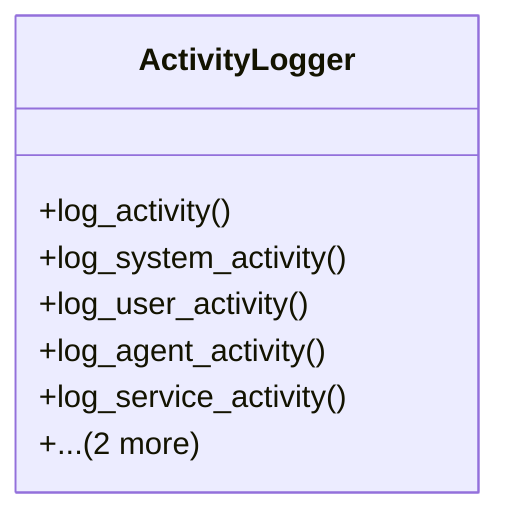

# integration_modules.ai.services.activity_logger

## Imports
- django.utils
- logging
- models

## Classes
- ActivityLogger
  - method: `log_activity`
  - method: `log_system_activity`
  - method: `log_user_activity`
  - method: `log_agent_activity`
  - method: `log_service_activity`
  - method: `get_recent_activities`
  - method: `get_activities_by_date_range`

## Functions
- log_activity
- log_system_activity
- log_user_activity
- log_agent_activity
- log_service_activity
- get_recent_activities
- get_activities_by_date_range

## Module Variables
- `logger`
- `activity_logger`

## Class Diagram

