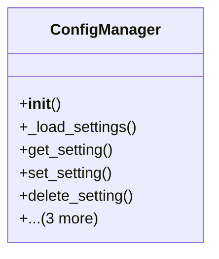

# integration_modules.ai.services.config_manager

## Imports
- django.conf
- json
- logging
- models

## Classes
- ConfigManager
  - method: `__init__`
  - method: `_load_settings`
  - method: `get_setting`
  - method: `set_setting`
  - method: `delete_setting`
  - method: `get_all_settings`
  - method: `import_settings`
  - method: `export_settings`

## Functions
- __init__
- _load_settings
- get_setting
- set_setting
- delete_setting
- get_all_settings
- import_settings
- export_settings

## Module Variables
- `logger`
- `config_manager`

## Class Diagram

