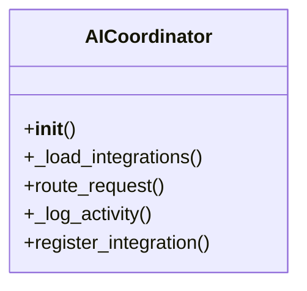

# integration_modules.ai.services.coordinator

## Imports
- django.conf
- logging
- models
- typing

## Classes
- AICoordinator
  - method: `__init__`
  - method: `_load_integrations`
  - method: `route_request`
  - method: `_log_activity`
  - method: `register_integration`

## Functions
- __init__
- _load_integrations
- route_request
- _log_activity
- register_integration

## Module Variables
- `logger`
- `ai_coordinator`

## Class Diagram

