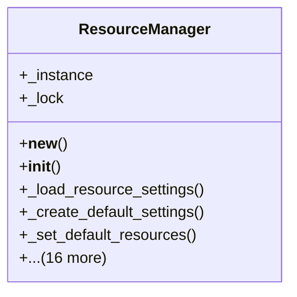

# integration_modules.ai.services.resource_manager

## Imports
- contextlib
- datetime
- django.conf
- django.utils
- logging
- models
- threading
- time
- typing

## Classes
- ResourceManager
  - attr: `_instance`
  - attr: `_lock`
  - method: `__new__`
  - method: `__init__`
  - method: `_load_resource_settings`
  - method: `_create_default_settings`
  - method: `_set_default_resources`
  - method: `_initialize_usage_stats`
  - method: `allocate_resources`
  - method: `release_resources`
  - method: `_check_resource_availability`
  - method: `_update_usage_stats`
  - method: `_update_average_response_time`
  - method: `_estimate_wait_time`
  - method: `_reset_usage_stats`
  - method: `acquire_resource`
  - method: `get_resource_usage`
  - method: `update_resource_settings`
  - method: `_validate_settings`
  - method: `get_health_status`
  - method: `_get_recommendations`
  - method: `_log_resource_allocation`
  - method: `_log_resource_release`

## Functions
- allocate_resources
- release_resources
- get_resource_usage
- get_health_status
- __new__
- __init__
- _load_resource_settings
- _create_default_settings
- _set_default_resources
- _initialize_usage_stats
- allocate_resources
- release_resources
- _check_resource_availability
- _update_usage_stats
- _update_average_response_time
- _estimate_wait_time
- _reset_usage_stats
- acquire_resource
- get_resource_usage
- update_resource_settings
- _validate_settings
- get_health_status
- _get_recommendations
- _log_resource_allocation
- _log_resource_release

## Module Variables
- `logger`
- `resource_manager`

## Class Diagram

