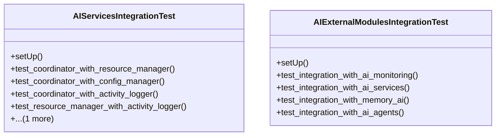

# integration_modules.ai.tests.test_integration

## Imports
- django.contrib.auth
- django.db
- django.test
- django.utils
- models
- services.activity_logger
- services.config_manager
- services.coordinator
- services.resource_manager

## Classes
- AIServicesIntegrationTest
  - method: `setUp`
  - method: `test_coordinator_with_resource_manager`
  - method: `test_coordinator_with_config_manager`
  - method: `test_coordinator_with_activity_logger`
  - method: `test_resource_manager_with_activity_logger`
  - method: `test_config_manager_with_activity_logger`
- AIExternalModulesIntegrationTest
  - method: `setUp`
  - method: `test_integration_with_ai_monitoring`
  - method: `test_integration_with_ai_services`
  - method: `test_integration_with_memory_ai`
  - method: `test_integration_with_ai_agents`

## Functions
- setUp
- test_coordinator_with_resource_manager
- test_coordinator_with_config_manager
- test_coordinator_with_activity_logger
- test_resource_manager_with_activity_logger
- test_config_manager_with_activity_logger
- setUp
- test_integration_with_ai_monitoring
- test_integration_with_ai_services
- test_integration_with_memory_ai
- test_integration_with_ai_agents

## Module Variables
- `User`

## Class Diagram

