# integration_modules.ai.tests.test_models

## Imports
- django.contrib.auth
- django.test
- django.utils
- models

## Classes
- AISettingsModelTest
  - method: `setUp`
  - method: `test_setting_creation`
  - method: `test_setting_str_representation`
  - method: `test_setting_update`
- AIActivityModelTest
  - method: `setUp`
  - method: `test_activity_creation`
  - method: `test_activity_str_representation`
  - method: `test_activity_ordering`
- AIIntegrationModelTest
  - method: `setUp`
  - method: `test_integration_creation`
  - method: `test_integration_str_representation`
  - method: `test_integration_update`
- APIKeyModelTest
  - method: `setUp`
  - method: `test_api_key_creation`
  - method: `test_api_key_str_representation`
  - method: `test_api_key_update`
- LearningSourceModelTest
  - method: `setUp`
  - method: `test_source_creation`
  - method: `test_source_str_representation`
- ConversationModelTest
  - method: `setUp`
  - method: `test_conversation_creation`
  - method: `test_conversation_str_representation`
  - method: `test_add_message`
- MessageModelTest
  - method: `setUp`
  - method: `test_message_creation`
  - method: `test_message_str_representation`
  - method: `test_message_ordering`

## Functions
- setUp
- test_setting_creation
- test_setting_str_representation
- test_setting_update
- setUp
- test_activity_creation
- test_activity_str_representation
- test_activity_ordering
- setUp
- test_integration_creation
- test_integration_str_representation
- test_integration_update
- setUp
- test_api_key_creation
- test_api_key_str_representation
- test_api_key_update
- setUp
- test_source_creation
- test_source_str_representation
- setUp
- test_conversation_creation
- test_conversation_str_representation
- test_add_message
- setUp
- test_message_creation
- test_message_str_representation
- test_message_ordering

## Module Variables
- `User`

## Class Diagram

```mermaid
classDiagram
    class AISettingsModelTest {
        +setUp()
        +test_setting_creation()
        +test_setting_str_representation()
        +test_setting_update()
    }
    class AIActivityModelTest {
        +setUp()
        +test_activity_creation()
        +test_activity_str_representation()
        +test_activity_ordering()
    }
    class AIIntegrationModelTest {
        +setUp()
        +test_integration_creation()
        +test_integration_str_representation()
        +test_integration_update()
    }
    class APIKeyModelTest {
        +setUp()
        +test_api_key_creation()
        +test_api_key_str_representation()
        +test_api_key_update()
    }
    class LearningSourceModelTest {
        +setUp()
        +test_source_creation()
        +test_source_str_representation()
    }
    class ConversationModelTest {
        +setUp()
        +test_conversation_creation()
        +test_conversation_str_representation()
        +test_add_message()
    }
    class MessageModelTest {
        +setUp()
        +test_message_creation()
        +test_message_str_representation()
        +test_message_ordering()
    }
```

