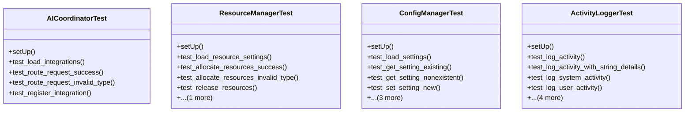

# integration_modules.ai.tests.test_services

## Imports
- django.contrib.auth
- django.test
- django.utils
- json
- models
- services.activity_logger
- services.config_manager
- services.coordinator
- services.resource_manager

## Classes
- AICoordinatorTest
  - method: `setUp`
  - method: `test_load_integrations`
  - method: `test_route_request_success`
  - method: `test_route_request_invalid_type`
  - method: `test_register_integration`
- ResourceManagerTest
  - method: `setUp`
  - method: `test_load_resource_settings`
  - method: `test_allocate_resources_success`
  - method: `test_allocate_resources_invalid_type`
  - method: `test_release_resources`
  - method: `test_get_resource_usage`
- ConfigManagerTest
  - method: `setUp`
  - method: `test_load_settings`
  - method: `test_get_setting_existing`
  - method: `test_get_setting_nonexistent`
  - method: `test_set_setting_new`
  - method: `test_set_setting_update`
  - method: `test_delete_setting`
  - method: `test_get_all_settings`
- ActivityLoggerTest
  - method: `setUp`
  - method: `test_log_activity`
  - method: `test_log_activity_with_string_details`
  - method: `test_log_system_activity`
  - method: `test_log_user_activity`
  - method: `test_log_agent_activity`
  - method: `test_log_service_activity`
  - method: `test_get_recent_activities`
  - method: `test_get_activities_by_date_range`

## Functions
- setUp
- test_load_integrations
- test_route_request_success
- test_route_request_invalid_type
- test_register_integration
- setUp
- test_load_resource_settings
- test_allocate_resources_success
- test_allocate_resources_invalid_type
- test_release_resources
- test_get_resource_usage
- setUp
- test_load_settings
- test_get_setting_existing
- test_get_setting_nonexistent
- test_set_setting_new
- test_set_setting_update
- test_delete_setting
- test_get_all_settings
- setUp
- test_log_activity
- test_log_activity_with_string_details
- test_log_system_activity
- test_log_user_activity
- test_log_agent_activity
- test_log_service_activity
- test_get_recent_activities
- test_get_activities_by_date_range

## Module Variables
- `User`

## Class Diagram

