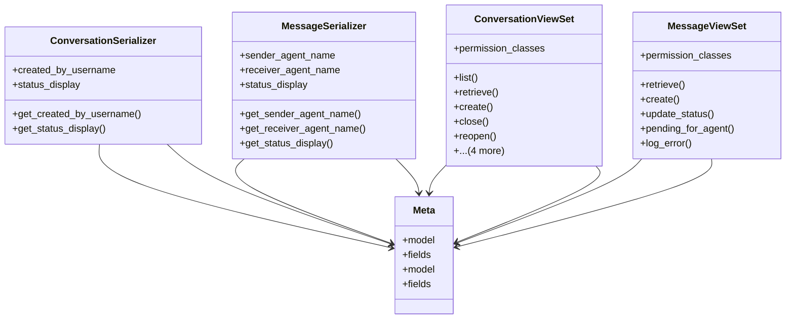

# integration_modules.ai_a2a.api.conversation_api

## Imports
- django.db
- django.shortcuts
- django.utils
- logging
- models
- rest_framework
- rest_framework.decorators
- rest_framework.response
- services.conversation_service

## Classes
- ConversationSerializer
  - attr: `created_by_username`
  - attr: `status_display`
  - method: `get_created_by_username`
  - method: `get_status_display`
- MessageSerializer
  - attr: `sender_agent_name`
  - attr: `receiver_agent_name`
  - attr: `status_display`
  - method: `get_sender_agent_name`
  - method: `get_receiver_agent_name`
  - method: `get_status_display`
- ConversationViewSet
  - attr: `permission_classes`
  - method: `list`
  - method: `retrieve`
  - method: `create`
  - method: `close`
  - method: `reopen`
  - method: `pause`
  - method: `archive`
  - method: `messages`
  - method: `statistics`
- MessageViewSet
  - attr: `permission_classes`
  - method: `retrieve`
  - method: `create`
  - method: `update_status`
  - method: `pending_for_agent`
  - method: `log_error`
- Meta
  - attr: `model`
  - attr: `fields`
- Meta
  - attr: `model`
  - attr: `fields`

## Functions
- get_created_by_username
- get_status_display
- get_sender_agent_name
- get_receiver_agent_name
- get_status_display
- list
- retrieve
- create
- close
- reopen
- pause
- archive
- messages
- statistics
- retrieve
- create
- update_status
- pending_for_agent
- log_error

## Module Variables
- `logger`

## Class Diagram

