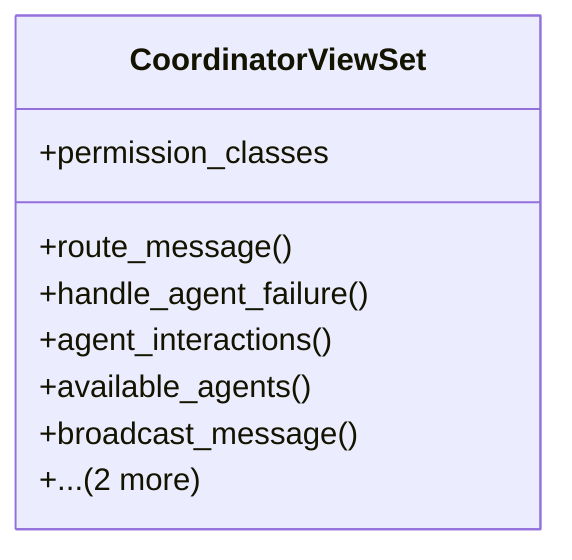

# integration_modules.ai_a2a.api.coordinator_api

## Imports
- conversation_api
- django.shortcuts
- logging
- models
- rest_framework
- rest_framework.decorators
- rest_framework.response
- services.coordinator_service

## Classes
- CoordinatorViewSet
  - attr: `permission_classes`
  - method: `route_message`
  - method: `handle_agent_failure`
  - method: `agent_interactions`
  - method: `available_agents`
  - method: `broadcast_message`
  - method: `register_agent`
  - method: `update_agent_status`

## Functions
- route_message
- handle_agent_failure
- agent_interactions
- available_agents
- broadcast_message
- register_agent
- update_agent_status

## Module Variables
- `logger`

## Class Diagram

