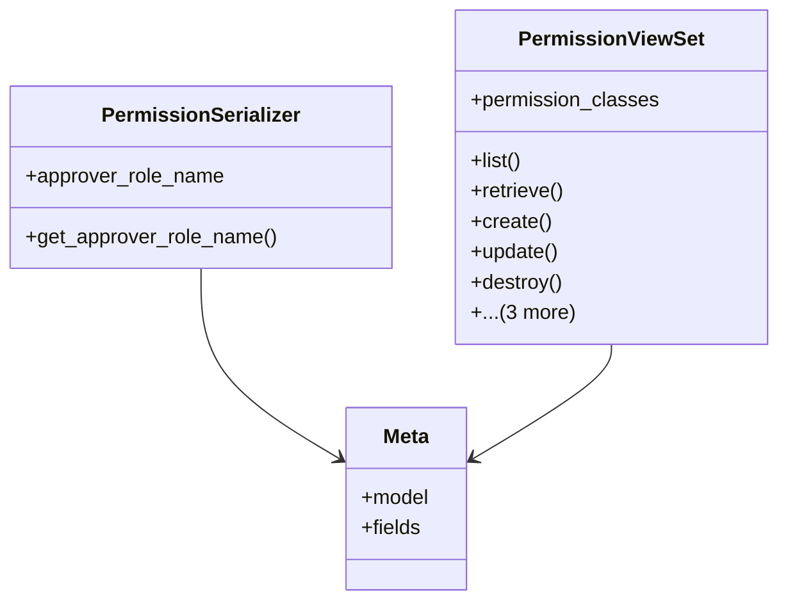

# integration_modules.ai_a2a.api.permission_api

## Imports
- django.db
- django.shortcuts
- django.utils
- logging
- models
- rest_framework
- rest_framework.decorators
- rest_framework.response
- services.permission_service

## Classes
- PermissionSerializer
  - attr: `approver_role_name`
  - method: `get_approver_role_name`
- PermissionViewSet
  - attr: `permission_classes`
  - method: `list`
  - method: `retrieve`
  - method: `create`
  - method: `update`
  - method: `destroy`
  - method: `check_permission`
  - method: `agent_permissions`
  - method: `bulk_create`
- Meta
  - attr: `model`
  - attr: `fields`

## Functions
- get_approver_role_name
- list
- retrieve
- create
- update
- destroy
- check_permission
- agent_permissions
- bulk_create

## Module Variables
- `logger`

## Class Diagram

