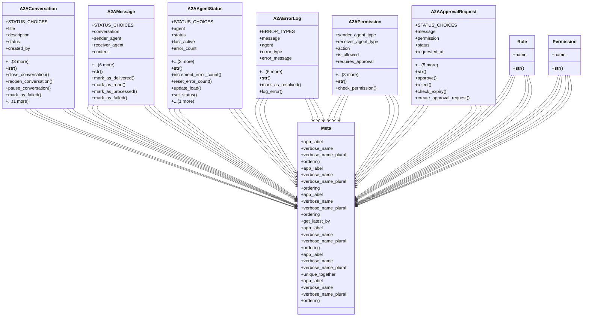

# integration_modules.ai_a2a.models

## Imports
- ai_agents.models
- core_modules.permissions.models
- core_modules.permissions.unified_permissions_model
- datetime
- django.conf
- django.db
- django.utils
- django.utils.translation
- logging

## Classes
- A2AConversation
  - attr: `STATUS_CHOICES`
  - attr: `title`
  - attr: `description`
  - attr: `status`
  - attr: `created_by`
  - attr: `created_at`
  - attr: `updated_at`
  - attr: `closed_at`
  - method: `__str__`
  - method: `close_conversation`
  - method: `reopen_conversation`
  - method: `pause_conversation`
  - method: `mark_as_failed`
  - method: `archive_conversation`
- A2AMessage
  - attr: `STATUS_CHOICES`
  - attr: `conversation`
  - attr: `sender_agent`
  - attr: `receiver_agent`
  - attr: `content`
  - attr: `status`
  - attr: `priority`
  - attr: `sent_at`
  - attr: `delivered_at`
  - attr: `read_at`
  - attr: `processed_at`
  - method: `__str__`
  - method: `mark_as_delivered`
  - method: `mark_as_read`
  - method: `mark_as_processed`
  - method: `mark_as_failed`
- A2AAgentStatus
  - attr: `STATUS_CHOICES`
  - attr: `agent`
  - attr: `status`
  - attr: `last_active`
  - attr: `error_count`
  - attr: `load`
  - attr: `details`
  - attr: `updated_at`
  - method: `__str__`
  - method: `increment_error_count`
  - method: `reset_error_count`
  - method: `update_load`
  - method: `set_status`
  - method: `get_available_agents`
- A2AErrorLog
  - attr: `ERROR_TYPES`
  - attr: `message`
  - attr: `agent`
  - attr: `error_type`
  - attr: `error_message`
  - attr: `stack_trace`
  - attr: `details`
  - attr: `is_resolved`
  - attr: `resolved_at`
  - attr: `resolved_by`
  - attr: `created_at`
  - method: `__str__`
  - method: `mark_as_resolved`
  - method: `log_error`
- A2APermission
  - attr: `sender_agent_type`
  - attr: `receiver_agent_type`
  - attr: `action`
  - attr: `is_allowed`
  - attr: `requires_approval`
  - attr: `approver_role`
  - attr: `created_at`
  - attr: `updated_at`
  - method: `__str__`
  - method: `check_permission`
- A2AApprovalRequest
  - attr: `STATUS_CHOICES`
  - attr: `message`
  - attr: `permission`
  - attr: `status`
  - attr: `requested_at`
  - attr: `approved_at`
  - attr: `approved_by`
  - attr: `reason`
  - attr: `response_note`
  - attr: `expiry_date`
  - method: `__str__`
  - method: `approve`
  - method: `reject`
  - method: `check_expiry`
  - method: `create_approval_request`
- Meta
  - attr: `app_label`
  - attr: `verbose_name`
  - attr: `verbose_name_plural`
  - attr: `ordering`
- Meta
  - attr: `app_label`
  - attr: `verbose_name`
  - attr: `verbose_name_plural`
  - attr: `ordering`
- Meta
  - attr: `app_label`
  - attr: `verbose_name`
  - attr: `verbose_name_plural`
  - attr: `ordering`
  - attr: `get_latest_by`
- Meta
  - attr: `app_label`
  - attr: `verbose_name`
  - attr: `verbose_name_plural`
  - attr: `ordering`
- Meta
  - attr: `app_label`
  - attr: `verbose_name`
  - attr: `verbose_name_plural`
  - attr: `unique_together`
- Meta
  - attr: `app_label`
  - attr: `verbose_name`
  - attr: `verbose_name_plural`
  - attr: `ordering`
- Role
  - attr: `name`
  - method: `__str__`
- Permission
  - attr: `name`
  - method: `__str__`

## Functions
- __str__
- close_conversation
- reopen_conversation
- pause_conversation
- mark_as_failed
- archive_conversation
- __str__
- mark_as_delivered
- mark_as_read
- mark_as_processed
- mark_as_failed
- __str__
- increment_error_count
- reset_error_count
- update_load
- set_status
- get_available_agents
- __str__
- mark_as_resolved
- log_error
- __str__
- check_permission
- __str__
- approve
- reject
- check_expiry
- create_approval_request
- __str__
- __str__

## Module Variables
- `logger`

## Class Diagram

