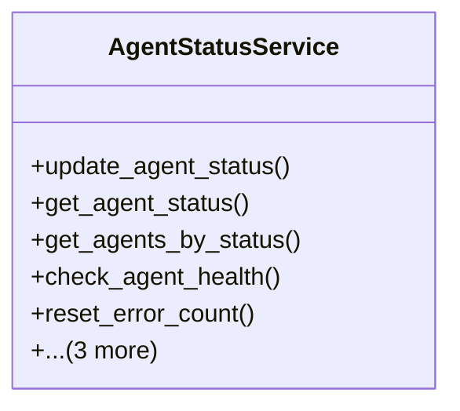

# integration_modules.ai_a2a.services.agent_status_service

## Imports
- ai_agents.models
- core_modules.setup.submodules.activity_logging.models
- django.contrib.auth
- django.core.exceptions
- django.db
- django.utils
- models

## Classes
- AgentStatusService
  - method: `update_agent_status`
  - method: `get_agent_status`
  - method: `get_agents_by_status`
  - method: `check_agent_health`
  - method: `reset_error_count`
  - method: `mark_agent_as_error`
  - method: `get_agent_status_history`
  - method: `_log_activity`

## Functions
- update_agent_status
- get_agent_status
- get_agents_by_status
- check_agent_health
- reset_error_count
- mark_agent_as_error
- get_agent_status_history
- _log_activity

## Module Variables
- `User`

## Class Diagram

