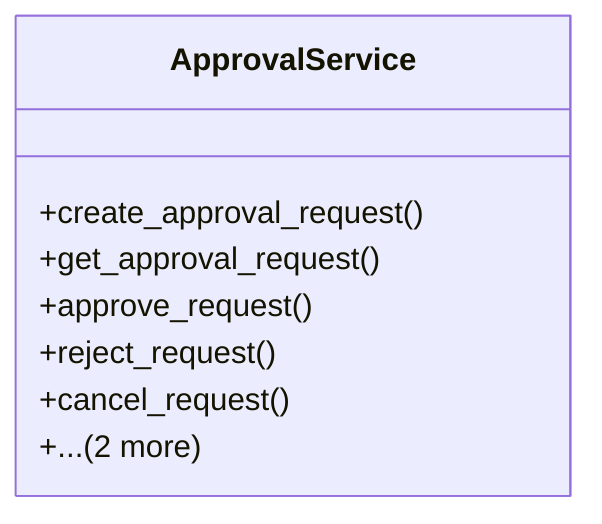

# integration_modules.ai_a2a.services.approval_service

## Imports
- ai_agents.models
- django.db
- django.utils
- models

## Classes
- ApprovalService
  - method: `create_approval_request`
  - method: `get_approval_request`
  - method: `approve_request`
  - method: `reject_request`
  - method: `cancel_request`
  - method: `get_pending_requests_for_agent`
  - method: `get_agent_approval_statistics`

## Functions
- create_approval_request
- get_approval_request
- approve_request
- reject_request
- cancel_request
- get_pending_requests_for_agent
- get_agent_approval_statistics

## Class Diagram

