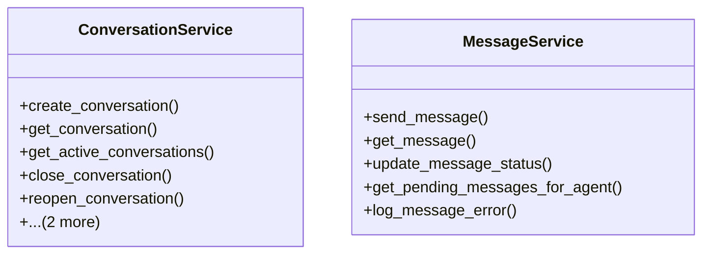

# integration_modules.ai_a2a.services.conversation_service

## Imports
- ai_agents.models
- django.db
- django.utils
- models

## Classes
- ConversationService
  - method: `create_conversation`
  - method: `get_conversation`
  - method: `get_active_conversations`
  - method: `close_conversation`
  - method: `reopen_conversation`
  - method: `get_conversation_messages`
  - method: `get_conversation_statistics`
- MessageService
  - method: `send_message`
  - method: `get_message`
  - method: `update_message_status`
  - method: `get_pending_messages_for_agent`
  - method: `log_message_error`

## Functions
- create_conversation
- get_conversation
- get_active_conversations
- close_conversation
- reopen_conversation
- get_conversation_messages
- get_conversation_statistics
- send_message
- get_message
- update_message_status
- get_pending_messages_for_agent
- log_message_error

## Class Diagram

